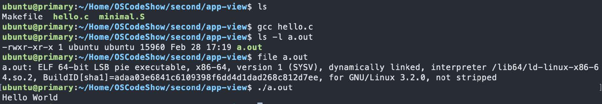
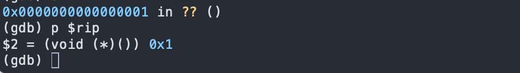

# 各种视角下的操作系统

---

## 一、概述

操作系统是极其复杂的软件系统：

- Linux 内核代码量从 1.0 版本的数万行，到 4.x 版本已突破 **2000 万行**；
- Windows 10 代码量超过 **5000 万行**，折合成书本约需 **1000～2000 本**（每本1000页，每页50行）；
- Linux 内核模块覆盖系统接口（system）、进程（processing）、内存（memory）、存储（storage）、网络（networking）、人机接口（human interface）等多个维度，组件间依赖关系极其复杂。

面对如此规模的系统，**选对视角**是理解它的关键——如同"盲人摸象"，从不同侧面切入才能形成完整认知。

### 操作系统的三条主线

| 主线 | 说明 |
|------|------|
| **软件（应用）** | 操作系统的服务对象 |
| **硬件（计算机）** | 操作系统直接运行于其上 |
| **操作系统本身** | 软件直接访问硬件带来麻烦太多，因而引入的中间件 |

理解操作系统，必须首先对其**服务对象（应用程序）**有精确的理解。

本讲从三个视角依次展开：

1. **应用视角**——操作系统是 syscall 的解释器
2. **硬件视角**——操作系统是直接访问硬件的 C 程序
3. **抽象视角**——操作系统本身就是一个状态机

---

## 二、应用视角下的操作系统

### 2.1 什么是程序？

#### 从 Hello World 出发

```c
#include <stdio.h>
int main() {
    printf("Hello, World\n");
}
```

用 IDE 一键运行虽然简单，但背后细节被完全隐藏。实际发生的过程分为两个阶段：

**编译阶段（text → binary，目标文件存于磁盘）：**

```
hello.c
  → [预处理器 cpp]  → hello.i   （展开宏、包含头文件）
  → [编译器 cc]     → hello.s   （生成汇编代码）
  → [汇编器 as]     → hello.o   （可重定位目标文件，binary）
  → [链接器 ld]     → hello     （可执行目标文件，binary，同时链入 printf.o）
```

**加载执行阶段（磁盘 → 内存 → CPU）：**

1. Loader（加载器）将可执行 ELF 文件加载到内存，建立如下虚拟地址空间布局：

    - Kernel memory（内核内存）
    - User Stack（用户栈，从高地址向低增长）
    - Shared libraries（共享库）
    - Runtime Heap（运行时堆，向高地址增长）
    - Global Data Segment（全局数据段）
    - Read-only Code Segment（只读代码段，从 `0x400000` 起）

    > 注意：低地址 `0x0` ～ `0x400000`：**刻意不映射**（deliberately unmapped），访问此区域引发段错误

2. 从 `entry point` 开始执行

#### 可执行文件结构（Typical ELF）

| 区段 | 内容 |
|------|------|
| header | 文件头信息 |
| mapping info header | 地址映射信息 |
| Code Instructions | 代码段（指令） |
| Initialized Data | 初始化数据段 |
| Symbol table & Debug Info | 符号表与调试信息 |

#### 动手观察的工具

| 工具 | 用途 |
|------|------|
| `gcc hello.c` | 编译生成 `a.out` |
| `file a.out` | 查看文件类型（ELF 64-bit LSB pie executable...） |
| `objdump -d a.out` | 反汇编查看机器码与汇编指令 |
| `gcc --verbose hello.c` | 查看 gcc 实际执行的编译选项与步骤 |
| `gcc -static hello.c` | 静态链接（文件体积将大幅增加） |
| `gcc -E hello.c` | 仅执行预处理 |

<figure markdown="span">
{ width=100% }
</figure>

#### 手动控制编译流程

```bash
cpp hello.c > hello.i          # 预处理（在这里我们发现stdio.h引入太多无效的代码，于是删掉删掉#include<stdio.h>）
gcc -c hello.i                 # 编译+汇编，生成 hello.o
objdump -d hello.o             # 查看目标文件的汇编
ld hello.o                     # 直接链接（会报错：找不到 'puts'，那我们就删掉printf）
ld hello.o -e main             # 指定入口为 main，生成 a.out
./a.out                        # 运行（会发生 Segmentation fault）
```

**为什么直接 `ld hello.o` 会报错？**

因为 `printf` 最终被编译为 `puts`，gcc 背后自动链接了 C 标准库（`libc`），手动 `ld` 时未指定该库，因此找不到符号。

**为什么 `./a.out`（删除 printf 后）出现 Segmentation fault？**

通过 GDB 调试分析：
```bash
gdb a.out
starti          # 从第一条指令开始执行
layout asm      # 显示汇编视图
info registers  # 查看所有寄存器
p $sp           # 查看栈指针
x $sp           # 查看栈顶内存内容
si              # 单步执行（step instruction）
```

<figure markdown="span">
{ width=100% }
</figure>

根本原因：`main` 函数通过 `ret` 指令返回时，它将**栈顶的值（argc = 1）**弹出给 `RIP`（程序计数器），导致 `PC = 0x1`。而 Linux x86-64 上，代码段从 `0x400000` 开始，`0x0` ～ `0x400000` 之间的低地址区域**刻意不映射**，访问地址 `0x1` 自然触发段错误。

正常情况下，内核的入口点不是 `main`，而是 `_start`。
`_start` 来自运行时启动代码（比如 `crt1.o`），它负责：

- 从栈里取出 `argc/argv/envp`
- 做 libc 初始化
- 调用 `__libc_start_main(...)`
- 再由它去调用 `main(argc, argv, envp)`
- `main` 返回后，不靠 `ret` 乱跳，而是调用 `exit`

所以正常流程其实是：

```text
kernel -> _start -> __libc_start_main -> main -> exit
```

不是：

```text
kernel -> main
```

所以，万恶之源还是我们把`ELF`的入口点强行设成了`main`，但`main`不是一个“进程入口函数”，它只是一个“普通C函数”!

**临时解决方案——加入无限循环：**

```c
int main() {
    while(1);
}
```

这样 `ret` 指令永远不会执行，但这并非真正的解决办法。

如果我们非要将`main`作为入口点进入，那么就不要靠普通函数返回，改成主动向操作系统发出“退出进程”的系统调用，即`syscall`.

### 2.2 程序的状态机模型

#### 二进制程序的状态机

一个运行中的程序可以用状态机来精确描述：

- **状态** = 内存 $M$ + 寄存器 $R$（包含 PC、栈指针等所有寄存器）
- **初始状态** = 操作系统加载程序后设置的初始内存与寄存器值
- **状态转移** = 执行一条指令

$$
(M, R) \xrightarrow{\text{执行 PC 指向的指令}} (M', R')
$$

每一步转移：

1. 从 `R[PC]` 取一条指令；
2. 解析指令，取出所需数据；
3. 计算结果（可能存在非确定性，如 `rdrand` 指令）；
4. 更新得到新状态 $(M', R')$。

#### 普通指令的局限性

程序中的所有普通指令（`mov`、`add`、`sub`、`call`、`ret`……）都只能用于**计算**，换句话说，它们只能操作内存与寄存器，**无法终止程序**、**无法与外部世界交互**（打印字符、读取文件等）。纯计算的状态机只能*死循环*或者*出现 undefined behavior（如访问非法地址）*。

#### 解决方案：syscall 指令

`syscall` 是一条特殊的指令，它将当前进程的 $(M, R)$ **完全交给操作系统**，由操作系统任意修改后再返回：

```c
#include <sys/syscall.h>
int main() {
    register int p1 asm("rax") = SYS_exit;  // 系统调用号
    register int p2 asm("rdi") = 1;         // 参数：退出码
    asm("syscall");
}
```

通过 `syscall`，程序可以：

- **读写文件/操作系统状态**：将文件内容写入内存 $M$；
- **改变进程状态**：创建进程（`fork`/`clone`）、销毁自己（`exit`）等。


执行 `syscall` 指令，CPU 从用户态陷入内核态，交给 Linux 内核处理。

内核看到：系统调用号是 `exit`，参数是 `1`，于是就会：

1. 终止当前进程
2. 回收资源
3. 把退出状态记成 1
4. 把控制权交还给父进程/shell

这样程序就能正常结束，原来的崩溃路径是：

```text
main 结束 -> ret -> RIP = 1 -> 跳到 0x1 -> SIGSEGV
```

现在变成：

```text
main 运行 -> syscall(exit, 1) -> 内核结束进程
```

可用 `man 2 syscall` 及 `man 2 syscalls` 查看所有系统调用文档。

#### Hello World 的汇编实现（x86-64）

```asm
#include <sys/syscall.h>
.globl _start
_start:
    movq $SYS_write, %rax   // write(
    movq $1,         %rdi   //   fd=1,
    movq $st,        %rsi   //   buf=st,
    movq $(ed - st), %rdx   //   count=ed-st
    syscall                 // );

    movq $SYS_exit,  %rax   // exit(
    movq $1,         %rdi   //   status=1
    syscall                 // );
st:
    .ascii "\033[01;31mHello, OS World\033[0m\n"
ed:
```

编译运行步骤：
```bash
cpp minimal.S > minimal.i
as minimal.i -o minimal.o
ld minimal.o
./a.out
```

> 在这个例子中，我们想强调的是：**程序退出最终依赖的是系统调用、依赖的是操作系统。**

#### 程序 = 计算 + syscall

从应用视角看：

- **程序** = 一系列普通计算指令 + `syscall` 调用序列；
- **操作系统** = `syscall` 的解释器（就如 CPU 解释普通指令一样）；
- 对程序而言，`syscall` 的执行是透明的——程序只感知"执行了一条指令后状态变化了"。

#### C 程序的状态机模型

高级语言（C）具有更高层次的抽象，其状态机定义为：

- **状态** = 堆（heap）+ 栈（stack）+ 全局变量（globals）
- **初始状态** = 仅有一个栈帧 `main(argc, argv)`，全局变量取初始值
- **状态转移** = 执行一条简单语句：
  - 执行调用栈栈顶帧 `frames.top.PC` 处的简单语句；
  - 函数调用 = 压入新栈帧并将新帧 `PC` 指向被调函数入口；
  - 函数返回 = 弹出当前栈帧（pop frame）。

> **注意**：C 是更高层的抽象，没有"寄存器"的概念，编译器负责将 C 状态机翻译为汇编状态机：`.s = compile(.c)`。不同优化级别（`-O0`、`-O2`）可产生不同的指令序列，但两种状态机在语义上应等价。

### 2.3 操作系统上的软件

操作系统中的**任何程序**，本质上都和 `minimal.S` 无异——**它们都是包含 `syscall` 的状态机**。

操作系统管理所有硬件与软件资源，应用程序只能通过操作系统允许的方式（`syscall`）访问系统中的对象，这种集中管理有助于解决资源抢占与冲突。

#### 追踪程序执行：`strace`

`strace`（system call trace）利用内核提供的 `ptrace` 系统调用，允许观测一个进程的 syscall 序列：

```bash
strace ./a.out
```

示例输出（最小 Hello World）：
```
execve("./a.out", ["./a.out"], 0x7ffc... /* 24 vars */) = 0
write(1, "\33[01;31mHello, OS World\33[0m\n", 28) = 28
exit(1)                                  = ?
+++ exited with 1 +++
```

**为什么能追踪进程？**

因为所有进程都运行在操作系统的监控之下，某种意义上运行在操作系统提供的"虚拟机"中，而非直面硬件。操作系统通过 `ptrace` 系统调用，允许一个进程查看、甚至修改另一个进程的运行时寄存器，乃至植入代码。`strace`、GDB 都基于 `ptrace` 实现。

#### 任何程序的一生

| 阶段 | syscall |
|------|---------|
| 加载 | `execve` |
| 进程管理 | `fork`、`execve`、`exit`（`strace -e trace=%process`） |
| 文件/设备管理 | `open`、`close`、`read`、`write`（`strace -e trace=%file`） |
| 存储管理 | `mmap`、`brk`（`strace -e trace=%memory`） |
| 终止 | `exit` 或 `exit_group` |

#### 操作系统中常见的应用程序

- **Core Utilities（coreutils）**：标准的文本与文件操作程序（GNU Coreutils），轻量替代品为 busybox；
- **系统/工具程序**：`bash`、`binutils`、`apt`、`ip`、`ssh`、`vim`、`tmux`、`jdk`、`python` 等；
- **其他应用**：浏览器、音乐播放器、游戏……

> **结论**：在应用眼中，**操作系统就是 syscall 的解释器**。

---

## 三、硬件视角下的操作系统

### 3.1 数字电路与状态机

计算机硬件的核心是数字电路，同样可以用状态机描述：

- **状态** = 寄存器（触发器 flip-flop）保存的值
- **初始状态** = RESET 信号触发后的值
- **状态转移** = 每个时钟周期，组合逻辑电路（NAND、NOT、AND、OR、NOR 等）计算寄存器下一个时钟周期的值

### 3.2 计算机硬件的状态机模型

整个计算机系统也是一个状态机：

- **状态** = 内存 + 所有寄存器的数值
- **初始状态** = CPU Reset 后的状态
- **状态转移**：

    1. 任意选择一个处理器（多核系统）；
    2. 响应该处理器的外部中断（若有）；
    3. 从该 CPU 的 PC 取指令并执行。

### 3.3 CPU Reset

硬件与操作系统开发者之间存在严格约定，其基础是 **CPU Reset 后的状态**。

#### x86 Family（Intel® 64 and IA-32）

| 寄存器 | Reset 值 | 含义 |
|--------|----------|------|
| `EIP` | `0x0000FFF0` | 程序计数器，指向 Reset Vector |
| `CR0` | `0x60000010` | 处理器处于**实模式**（Real Mode），分页机制关闭，CPU 处于 16-bit 状态 |
| `EFLAGS` | `0x00000002` | 中断禁用（Interrupt disabled） |

#### 其他架构的 Reset Vector

| 架构 | Reset Vector | 备注 |
|------|-------------|------|
| MIPS | `0xBFC00000` | 固定 |
| ARM | `0x00000000` | 可通过 Reset Vector Base Address Register 配置 |
| RISC-V | Implementation defined | 给厂商最大自由度 |

### 3.4 Firmware（固件）

CPU Reset 后 PC 指向的地址通过 Memory-mapped I/O 映射到主板上的 ROM，ROM 中存储的代码称为 **Firmware（固件）**。

厂商通过 Firmware 为操作系统开发者提供：

- 管理硬件和系统配置；
- 把存储设备上的代码加载到内存（二级 Loader 或操作系统）。

#### 两种 Firmware 标准

| 标准 | 全称 | 特点 |
|------|------|------|
| **BIOS** | Basic Input/Output System | 传统标准，只支持有限硬件，代码空间受限（MBR 仅 512 字节） |
| **UEFI** | Unified Extensible Firmware Interface | 现代标准，支持驱动程序（EFI Driver）、支持 Secure Boot、性能更好、支持任意大小 .efi 可执行文件 |

**为何需要 UEFI？** 

现代计算机硬件极其复杂（指纹锁、USB 蓝牙转接器等），这些设备都需要驱动程序才能访问，BIOS 的有限能力无法胜任。

### 3.5 Legacy BIOS 启动约定

1. Legacy BIOS 将第一个可引导设备的**第一个 512 字节**（MBR，Master Boot Record）加载到物理内存 `0x7C00`；
2. 此时处理器处于 16-bit 实模式；
3. 规定 `CS:IP = 0x7C00`；
4. 其他状态无约束，**控制权交给程序员**；
5. MBR 布局：前 440 字节为 Boot Loader 代码 + 6 字节磁盘签名 + 64 字节分区表 + 2 字节魔数（`0x55AA`）。

### 3.6 UEFI 启动流程

1. 磁盘按 **GPT**（GUID Partition Table）格式化；
2. 预留一个 **FAT32 分区**（EFI System Partition）；
3. Firmware 加载 `.efi` 格式的 PE 可执行文件（EFI Bootcode → OS Loader）；
4. EFI 应用可再次返回 Firmware。

### 3.7 加载器（Bootloader）工作细节

以 Legacy BIOS + 一级 Bootloader 为例，启动流程为：

```
CPU RESET → BIOS → MBR（Bootloader） → ELF 镜像（初始化C环境） → 操作系统 main 函数
```

MBR 中的 Bootloader 主要完成：

1. 将处理器从 **16-bit 实模式**切换到 **32-bit 保护模式**（乃至 64-bit 长模式）；
2. 跳转到 ELF32/ELF64 加载器；
3. 按约定的磁盘镜像格式，将操作系统内核（ELF 文件）加载到内存；
4. 跳转到内核入口：

```c
if (elf32->e_machine == EM_X86_64) {
    ((void(*)())(uint32_t)elf64->e_entry)();
} else {
    ((void(*)())(uint32_t)elf32->e_entry)();
}
```

对于 Linux，GRUB 是两阶段 Bootloader：MBR 中的 GRUB Stage 1 加载 Stage 2，Stage 2 再加载内核。

### 3.8 使用 QEMU + GDB 观察启动过程

QEMU 模拟完整的硬件系统，可以在模拟环境中观察每一条指令的执行：

```bash
# 启动 QEMU，加载 MBR 镜像，开启 GDB 服务器（端口 1234），启动后 CPU 先暂停
qemu-system-x86_64 -s -S mbr.img

# 另一终端，连接 GDB
gdb
target remote localhost:1234
```

通过此方法可以验证：

- CPU Reset 后 PC 指向 `0xFFF0`（Firmware 入口）；
- MBR 的第一条指令被 BIOS 加载到 `0x7C00`；
- 利用 GDB watchpoint 可以观察到是哪段代码将 MBR 内容写入内存。

### 3.9 Bare-metal 上的 C 代码

在没有操作系统的裸机上运行 C 程序，需要：

1. MBR 中的 Bootloader 将 C 程序加载到内存；
2. 使用编译器的特殊选项生成不依赖操作系统的目标文件：
   - **静态链接**：不依赖动态库；
   - **Freestanding 模式**（`-fno-hosted`）：不使用任何标准库。

代价是没有 `printf`、`malloc` 等，需要自行实现。

### 3.10 Abstract Machine（AM）抽象机器

为屏蔽不同硬件体系（x86、MIPS、RISC-V 等）的差异，本课程使用 **AM（Abstract Machine）** 作为硬件抽象层：

```bash
git clone https://github.com/NJU-ProjectN/abstract-machine.git
```

AM 提供以下扩展模块：

| 模块 | 全称 | 功能 |
|------|------|------|
| **TRM** | Turing Machine | 基础计算：内存、CPU、寄存器 |
| **IOE** | I/O Extension | I/O 设备：定时器、键盘、GPU 等 |
| **CTE** | Context Extension | 上下文切换（中断/异常处理） |
| **VME** | Virtual Memory Extension | 虚拟内存（页表机制） |
| **MPE** | Multi-Processor Extension | 多处理器支持、共享内存 |

AM 本身也是一个状态机：执行一条指令完成状态迁移，包含正常指令流和中断处理指令流两种路径。

### 3.11 两种执行流

#### 普通控制流（Normal Control Flow）

遵循冯·诺依曼结构的指令循环：

```
Select PC → Program Counter → CPU Fetch & Execute → +1 / Branch → Select PC → ...
```

PC 的变化仅由指令自身决定（顺序 +1，或跳转指令改变 PC）。

#### 异常控制流（Exceptional Control Flow）

PC 的转移**不受**正常自增或分支指令控制，而由"外界"强制赋值：

- 触发条件：中断（interrupt）、异常（exception/fault）、自陷指令（trap，如 `syscall`）；
- 处理器查表（实地址模式：中断向量表 IVT；保护模式：中断描述符表 IDT），跳转到对应的中断服务例程（ISR）；
- 处理完毕后恢复到之前的正常执行流。

**异步事件处理示例**：`Ctrl+C` 终止进程的流程：

1. 键盘产生中断，操作系统中断处理程序捕获；
2. 操作系统识别 `Ctrl+C`，向目标进程发送 `SIGINT` 信号；
3. 进程终止正常指令流，跳转到 `SIGINT` 信号处理函数；
4. 信号处理函数执行，进程退出。

这是 **Event-driven programming** 的典型体现。

### 3.12 上下文切换（Context Switch）

进入异常控制流前，CPU 必须保存当前的**执行现场（Context）**，否则无法恢复原来的执行。

**什么是上下文？**

寄存器的值（它们不像栈/堆保存在内存中，一旦被覆写，旧值即丢失）。不同架构的上下文略有差异，AM 统一抽象为 `Context` 结构体，主要包含：

| 内容 | 说明 |
|------|------|
| PC 寄存器（CS、IP） | 下一条指令地址 |
| 栈指针（SP、SS） | 当前栈位置 |
| 控制寄存器（EFLAGS 等） | 处理器标志位 |
| 虚拟地址翻译入口寄存器 | 页表基址等 |
| 其他数据寄存器（EAX、EBX …） | 通用寄存器 |

**上下文切换过程（x86 示例）：**

1. **异常事件发生前**：CPU 寄存器保存当前进程状态，用户栈正常使用；
2. **异常事件发生时**：CPU 将 `EFLAGS`、`CS:EIP`、`SS:ESP` 等上下文压入**内核栈**，转向异常处理程序；
3. **异常处理结束，进程被再次调度**：从内核栈弹出（POP）上下文，CPU 恢复原进程执行。

**重要意义**：Context 机制使操作系统能够**保存和恢复任意进程的执行状态**，从而实现**分时复用**——给程序制造了"独占 CPU"的假象。这是分时操作系统的核心。

> **关于中断嵌套**：中断处理期间若又发生中断，通常做法是在进入中断处理程序时**禁用中断**（将新中断存入队列），处理结束时再重新启用。

### 3.13 在 AM 上实现操作系统

操作系统本质上只能控制两部分代码：

1. **`main` 函数**（经历 CPU reset → BIOS → MBR → C 环境初始化后到达）：用于初始化整个计算系统环境；
2. **中断/异常响应函数**（Interrupt/Trap/Fault Handler）：响应异步事件，实现各种内核服务。

这就是**硬件眼中的操作系统**。

> **结论**：在硬件眼中，**操作系统就是一个能直接访问计算机硬件的 C 程序**。

---

## 四、抽象视角下的操作系统

### 4.1 操作系统本身就是状态机

前两个视角分别从"自顶向下"（应用）和"自底向上"（硬件）观察操作系统，但没有从全局把握。抽象视角将操作系统视为一个**状态机**，从整体上理解其生命周期。

### 4.2 操作系统的一生

#### 初始化阶段

```
CPU RESET
  → BIOS / UEFI（Firmware）
  → Bootloader（MBR / EFI Bootcode）
  → 加载内核 ELF 镜像
  → 内核初始化：
      - 初始化内存、处理器、I/O、存储设备
      - 设置中断处理（IRQ）
      - 挂载 initrd，加载必要驱动，卸载 initrd
      - 挂载根文件系统（root filesystem）
  → 启动第一个用户态进程：init（现代 Linux 为 systemd）
  → yield CPU，进入"被动等待"状态
```

初始化结束后，内核形成如下**状态**（内核内存布局）：

| 区域 | 内容 |
|------|------|
| 内核代码区 | 内核代码 |
| 内核堆 | 动态分配的内核数据结构 |
| 内核栈 1, 2, … | 每个进程一个内核栈 |
| Meta(进程 1, 2, …) | 进程控制块（PCB）：进程 id、栈指针、PC 等 |
| Meta(文件 1, 2, …) | 文件元信息 |
| Meta(地址 1, 2, …) | 地址空间元信息 |

#### 运行阶段

操作系统初始化完成后，**变成 interrupt/trap/fault handler 的集合**，状态被动迁移：

**用户进程执行 syscall（trap）：**

```
用户进程 → syscall（自陷）→ 内核 syscall 处理代码
          ─────────────────────────────────────────
          s  →（执行相应系统调用代码，可能需要硬件辅助）
             →（等待硬件完成，如磁盘 I/O，期间可调度其他进程）
             →（硬件中断通知完成）
          s' →（返回用户空间，用户进程继续）
          s''
```

**硬件中断发生：**

时钟中断等硬件事件直接触发内核中断处理程序，内核可借此执行调度，切换到不同的用户进程。

### 4.3 操作系统的抽象状态机总结

| 特征 | 描述 |
|------|------|
| **内部状态** | 进程/线程元信息、文件元信息、地址空间元信息、内核栈、内核堆、内核代码区 |
| **状态迁移触发条件** | ① 用户进程执行 syscall（trap）；② 硬件中断事件（时钟中断、I/O 完成中断等） |
| **主动性** | 操作系统的状态是**被动迁移**的，自身不主动执行 |
| **角色** | 初始化后成为 interrupt/trap/fault handler |

### 4.4 用代码实现抽象操作系统（os-model.py）

#### API 设计

| syscall | 功能 |
|---------|------|
| `sys_choose(xs)` | 返回 xs 中的一个随机选项（模拟非确定性） |
| `sys_write(s)` | 输出字符串 s |
| `sys_spawn(fn)` | 创建从 fn 开始执行的新状态机（线程/进程） |
| `sys_sched()` | 随机切换到任意状态机执行 |

#### 借用 Python Generator 机制

Python 的 Generator（生成器）天然支持"暂停执行、保存状态、恢复执行"：

```python
def number(a):
    while True:
        a += 1
        yield a          # 暂停，将 a 产出给调用者

c = number(3)
next(c)   # → 4，恢复执行到下一个 yield
next(c)   # → 5

# 用 send() 向生成器传递值
a = yield a    # yield 表达式的值由 send() 决定
c.send(5)      # → 6（即 5+1）
c.send(None)   # 等价于 next(c)，不传递值
```

生成器中的 `yield` 相当于"让出 CPU 并告知调用者当前状态"，这与 syscall 的语义非常契合。

#### Thread 类（封装状态机）

```python
class Thread:
    """A "freezed" thread state."""
    def __init__(self, func, *args):
        self._func = func(*args)   # 根据目标程序创建生成器
        self.retval = None

    def step(self):
        """Proceed with the thread until its next trap."""
        syscall, args, *_ = self._func.send(self.retval)  # 运行到下一个 syscall
        self.retval = None
        return syscall, args
```

#### 操作系统内核（syscall 解释器）

```python
def run(self):
    threads = [OperatingSystem.Thread(self._main)]   # 初始化：只有 main 线程
    while threads:                                    # 有线程存活就继续运行
        try:
            match (t := threads[0]).step():
                case 'choose', xs:            # sys_choose
                    t.retval = random.choice(xs)
                case 'write', xs:             # sys_write
                    print(xs, end='')
                case 'spawn', (fn, args):     # sys_spawn
                    threads += [OperatingSystem.Thread(fn, *args)]
                case 'sched', _:              # sys_sched
                    random.shuffle(threads)
        except StopIteration:                 # 线程终止
            threads.remove(t)
            random.shuffle(threads)           # 隐式调度
```

#### 应用程序示例

```python
count = 0

def Tprint(name):
    global count
    for i in range(3):
        count += 1
        sys_write(f'#{count:02} Hello from {name}{i+1}\n')
        sys_sched()   # 主动让出 CPU

def main():
    n = sys_choose([3, 4, 5])
    sys_write(f'#Thread = {n}\n')
    for name in 'ABCDE'[:n]:
        sys_spawn(Tprint, name)
    sys_sched()
```

### 4.5 更完整的 Toy OS：Mosaic

`mosaic.py` 提供更接近真实 Linux 的系统调用映射：

| mosaic syscall | Linux 对应 | 作用 |
|----------------|-----------|------|
| `sys_spawn(fn)` | `pthread_create` | 创建从 fn 开始执行的线程（共享内存） |
| `sys_fork()` | `fork` | 创建当前状态机的完整复制（独立堆） |
| `sys_sched()` | 调度器 | 切换到随机线程/进程执行 |
| `sys_choose(xs)` | `rand` | 返回 xs 中的随机选择 |
| `sys_write(s)` | `printf` | 向调试终端输出字符串 |
| `sys_bread(k)` | `read` | 读取虚拟磁盘块 k 的数据 |
| `sys_bwrite(k, v)` | `write` | 向虚拟磁盘块 k 写入数据 |
| `sys_sync()` | `sync` | 将所有虚拟磁盘数据落盘 |

**设计要点：**

- 进程/线程均为 Generator 对象；
- 线程共享堆内存，进程拥有独立的堆（clone）；
- 虚拟磁盘简化为 Python dict；
- 实际系统中程序随时可能被外部事件（如时钟中断）打断，mosaic 对此做了简化。

**Mosaic 的彩蛋——枚举所有调度序列：**

当执行 `sys_sched()` 时，Mosaic 可以**枚举所有可能的调度序列**，生成一棵状态树：

```
s1 → （任意挑选一个进程执行一步）
     ├── s2₁ → ...（调度进程 A）
     ├── s2₂ → ...（调度进程 B）
     └── s2₃ → ...（调度进程 C）
```

这等价于一台**非确定性图灵机（Nondeterministic Turing Machine）**，可用于验证并发程序在所有可能调度下的正确性——这是形式化验证（model checking）的核心思想。

---

## 五、总结

操作系统在三个视角下分别呈现出不同的面貌，三者相互补充，共同构成完整的认知：

| 视角 | 核心结论 |
|------|---------|
| **应用视角** | 操作系统是 syscall 的解释器；程序 = 计算 + syscall，是包含系统调用的状态机 |
| **硬件视角** | 操作系统是直接运行在硬件之上的 C 程序，拥有完整计算机的控制权限（中断、I/O） |
| **抽象视角** | 操作系统本身是状态机：内部状态为其管理的资源，状态被动迁移（syscall / 硬件中断触发）；初始化后成为 interrupt/trap/fault handler |

---

## 六、阅读材料

- **[CSAPP]** 第 1、7、8 章（计算机系统概览、链接、异常控制流）
- **[OSPP]** 第 1、2 章（操作系统概述）
- 浏览 **GNU Coreutils** 和 **GNU Binutils** 官网，建立常用命令行工具的整体印象
- 浏览 **GDB 文档**目录，了解感兴趣的章节，例如 "Reverse Execution"、"TUI: GDB Text User Interface"
- 参考 **busybox** 和 **toybox** 项目，查看常用命令行工具的简化实现
- **AM（Abstract Machine）**：[https://jyywiki.cn/OS/AbstractMachine/index.html](https://jyywiki.cn/OS/AbstractMachine/index.html)
- **AM 代码仓库**：[https://github.com/NJU-ProjectN/abstract-machine](https://github.com/NJU-ProjectN/abstract-machine)
- **AM 示例内核**：[https://github.com/NJU-ProjectN/am-kernels](https://github.com/NJU-ProjectN/am-kernels)