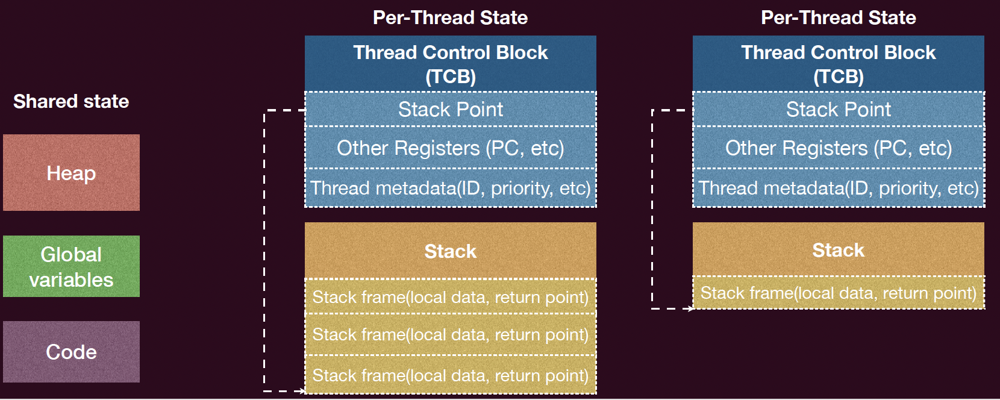
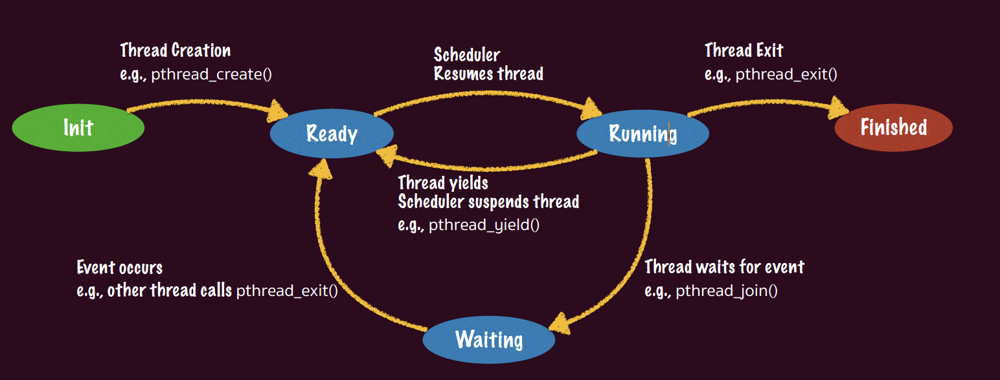

# 并发与多处理器编程
---

## 一、为什么需要多处理器编程

### 1.1 单处理器时代的终结

根据 **摩尔定律（Moore's Law）**，集成电路上可容纳的晶体管数量每两年翻一番。然而自 21 世纪初起，受限于物理瓶颈（漏电流、散热等），**时钟频率（Clock Frequency）** 基本停滞增长，单核性能的提升进入瓶颈期。

为了持续提升算力，处理器厂商转向 **多核心（Multi-core）** 架构：通过堆叠更多处理器核心，依赖 **并行计算（Parallel Computing）** 来提升整体吞吐量。

这意味着程序员不能再依赖"硬件自动变快"的红利，而必须主动对程序进行 **并行化（Parallelization）**。

### 1.2 并行加速的上限：Amdahl 定律

**Amdahl's Law** 量化了并行化的加速上界。

**定义：**

- 并行加速比（Speedup）：$\text{speedup} = \dfrac{\text{1-thread execution time}}{\text{n-thread execution time}}$
- 设程序中可并行化部分的比例为 $p$，不可并行化部分（串行部分）为 $1 - p$
- 在 $n$ 个并行执行流下，加速比为：

$$\text{speedp} = \frac{1}{(1 - p) + \dfrac{p}{n}}$$

**推论：** 当 $n \to \infty$ 时，加速比趋近于 $\dfrac{1}{1-p}$。即使拥有无限多的 CPU，程序的加速比也受限于其**串行部分（Sequential Fraction）** 的比例，无法无限加速。

**实践意义：**

1. 并行化的收益会随核心数的增加而递减（边际效益递减）。
2. 减小串行部分（提高 $p$）比单纯增加核心数更为有效。
3. 并行化和同步本身的开销会进一步压低实际加速比。

### 1.3 并发编程的核心难点

并行化面临的根本困难在于：**代码的并行化和同步极易出错**。人类天生以线性方式思考，而并发程序的状态空间是指数级的，难以穷举。操作系统本身就是世界上最早的并发程序之一，并发是其核心组成部分。

---

## 二、线程（Thread）基础

### 2.1 线程的定义

**线程（Thread）** 是并发的基本单位，定义为：**共享内存的执行流（Execution Flow with Shared Memory）**。

一个进程可以包含多个线程。线程的性质：

- **独享（Per-Thread）**：程序计数器（PC）、通用寄存器、栈指针（SP）及对应的 **栈（Stack）**（包含栈帧、局部变量、返回地址等）；
- **共享（Shared）**：堆空间（Heap）、全局变量（Global Variables）、代码段（Code Segment）等进程地址空间中的其他区域。

> **注意**：线程间栈空间的"独享"只是一种约定（Convention），操作系统层面并不强制隔离。地址空间保护（Address Space Protection）是进程间的概念，而非线程间的概念。

### 2.2 线程控制块（TCB）

每个线程在操作系统中由一个 **线程控制块（Thread Control Block, TCB）** 描述，其内容包括：

- 栈指针（Stack Pointer）
- 程序计数器及其他寄存器（PC, General-purpose Registers）
- 线程元数据（Thread Metadata）：线程 ID、优先级等

<figure markdown="span">
{ width=80% }
</figure>

### 2.3 多线程的状态机模型

从形式化角度，多线程程序可建模为：**多个共享内存的状态机（State Machines with Shared Memory）**。

- **状态（State）**：每个线程的私有状态（寄存器、栈） + 所有线程共享的内存状态
- **初始状态**：所有线程创建时刻的状态
- **状态迁移**：调度器（Scheduler）**任意**选择一个线程，执行一条指令，使系统状态发生转移

**关键特性**：当线程 $T_2$ 执行一步并修改共享内存时，$T_1$ 的可见状态也可能随之改变，而 $T_1$ 对此毫不知情——这正是并发程序难以推理的根本原因。

---

## 三、POSIX 线程 API（Pthreads）

POSIX 标准提供了 `<pthread.h>` 库，是 Unix/Linux 系统上多线程编程的标准接口，编译时需链接 `-lpthread`。

| 函数 | 语义 |
|---|---|
| `pthread_create(thread, attr, start_routine, arg)` | 创建一个新线程，以 `arg` 为实参运行 `start_routine`；`attr` 为线程属性（默认 `NULL`） |
| `pthread_exit(retval)` | 终止当前线程，向 `pthread_join` 方返回 `retval`；若 `start_routine` 正常返回，效果等同 |
| `pthread_join(thread, retval)` | **阻塞**调用者，等待目标线程 `thread` 终止，其返回值写入 `retval` 指向的内存 |
| `pthread_yield` / `sched_yield()` | 主动放弃当前 CPU 使用权（`pthread_yield` 已废弃，推荐 `sched_yield`） |
| `pthread_detach(thread)` | 将线程设为**分离态（Detached）**，使其不可被其他线程 `join`，主进程退出后也不被强制终止 |

例子：

```cpp
#include <pthread.h>
#include <cstdio>
#include <cstdlib>
#include <cstdint>
#define NUMBER_OF_THREADS 10
void* print_hello_world(void* tid) {
    int thread_id = static_cast<int>(reinterpret_cast<intptr_t>(tid));
    printf("Hello World. Greetings from thread %d\n", thread_id);
    pthread_exit(nullptr);
}
int main() {
    pthread_t threads[NUMBER_OF_THREADS];
    int status;
    for (int i = 0; i < NUMBER_OF_THREADS; ++i) {
        printf("Main here. Creating thread %d\n", i);
        status = pthread_create(&threads[i], nullptr, print_hello_world, reinterpret_cast<void*>(static_cast<intptr_t>(i)));
        if (status != 0) {
            printf("Oops. pthread_create returned error code %d\n", status);
            exit(-1);
        }
    }
    for (int i = 0; i < NUMBER_OF_THREADS; ++i) {
        pthread_join(threads[i], nullptr);
    }
    return 0;
}
```

### 3.1 线程生命周期

线程在其生命周期中经历以下状态转换：

```
Init ──[pthread_create]──► Ready ◄──[Scheduler Resumes]──► Running ──[pthread_exit]──► Finished
                              ▲                                  │
                              │                                  │ [pthread_join / 等待事件]
                   [事件发生]  │                                   ▼
                              └──────────────────────────── Waiting
                                                            (等待同步事件)
```

<figure markdown="span">
{ width=80% }
</figure>

- **Ready（就绪）**：线程 TCB 在操作系统维护的 Ready Queue 中等待调度
- **Running（运行）**：线程上下文（Context）被加载到 CPU 寄存器中执行
- **Waiting（等待）**：线程 TCB 在同步等待队列中等待特定事件（如另一线程退出）
- **Finished（终止）**：线程执行完毕

> 只有在运行阶段，其Context才会在CPU上，其余都在内核栈上，当线程处于就绪阶段时其TCB在OS维护的ready列表上等待调度，当线程处于等待阶段时，其TCB在OS维护的同步等待列表上等待同步事件发生.

---

## 四、并发的三大核心挑战（Heisenbug 的根源）

并发程序中存在一类难以复现的 Bug，称为 **Heisenbug**：这类 Bug 具有不确定性，不是每次执行都能被捕捉。其根本原因来自于以下三类性质的丧失。

---

### 4.1 原子性丧失（Loss of Atomicity）

#### 原子性的定义

**原子性（Atomicity）** 是指一个操作在更高层次的抽象上不可分割，具有两个属性：

1. **All-or-Nothing**：操作要么全部完成，要么一点不做，不向外界暴露中间状态；
2. **Isolation（隔离性）**：操作访问共享变量时不会被其他操作中途干扰；其他所有对该变量的操作要么发生在此操作之前，要么在其之后。

#### 现实中的原子性丧失

高级语言中的一条语句（如 `sum++`）在编译后往往对应多条机器指令：

```asm
mov  $sum, %rax    ; Load
add  1,   %rax     ; Increment
mov  %rax, $sum    ; Store
```

**单处理器多线程场景**：线程在 Load/Store 之间可能被中断并切换到另一线程，违反 All-or-Nothing。

**多处理器多线程场景**：两个线程真正并行执行，即使使用单条指令（如 `incq sum`），也可能因为两个 CPU 同时访问同一内存地址而发生 **数据竞争（Data Race）**，违反 Isolation。

这种多个线程竞争同一共享数据的现象称为 **数据竞争（Data Race）**，是并发 Bug 的首要来源。

#### 解决方案：互斥（Mutual Exclusion）

通过 **锁（Lock）** 实现 **临界区（Critical Section）** 内的原子执行：
```c
lock(&lk); // 临界区：同一时刻只有一个线程可以执行
sum++;
unlock(&lk);
```

- `lock` / `unlock` 保证临界区之间的绝对串行化
- 程序的其他非临界区部分仍可并行执行

---

### 4.2 顺序性丧失（Loss of Order / Instruction Reordering）

#### 顺序性的定义

**顺序性（In-order Execution）** 是指程序语句按照源码中书写的顺序依次执行。

#### 编译器重排序（Compiler Reordering）

编译器在保证**单线程语义不变**的前提下，会对指令进行重排以优化性能（如减少 Cache Miss、流水线停顿等）。这在单线程下是安全的，但在多线程下会破坏程序逻辑。

**典型案例 1（`-O1` 优化）**：
```c
// 原始代码
for (int i = 0; i < N; i++) { sum++; }
```
编译器将 `sum` 提升（Hoist）到寄存器，循环结束后再写回内存，等效变为：
```c
register long tmp = sum;
tmp += N;
sum = tmp;  // 最后才写回共享变量
```
这完全破坏了多线程下的并发语义。

**典型案例 2（`-O2` 优化）**：
```c
while (!done);
// 被优化为：
if (!done) while (1);  // 无限循环，永远读不到另一线程对 done 的修改
```

#### 控制编译器重排的手段

1. **编译器屏障（Compiler Barrier）**：
   ```c
   asm volatile ("" ::: "memory");
   ```
   告知编译器此处可能读写任意内存，禁止跨越此屏障进行指令重排。

2. **`volatile` 关键字**：
   ```c
   volatile bool done;
   ```
   标记变量的每次 Load/Store 均不可优化，强制从内存读取。

> **注意**：上述手段是权宜之计。本课程推荐的正规解决方案是**锁（Lock）**，其隐式包含编译器和硬件级别的屏障语义。

---

### 4.3 全局一致性丧失（Loss of Global Consistency / Memory Consistency）

#### 问题来源：处理器乱序执行

现代处理器为了隐藏高时延操作（如 Cache Miss）的延迟，在硬件层面也会对指令进行**乱序执行（Out-of-Order Execution）**。不同的处理器核心可能以不同的顺序观察到对共享内存的访问，即产生**内存访问顺序不一致**的问题。

为了解决这个问题，**内存一致性模型（Memory Consistency Model）** 明确定义了不同核心对共享内存操作需要遵循的可见顺序规范。

---

#### 4.3.1 顺序一致性模型（Sequential Consistency, SC）

**SC 模型**提供了最强的保证：

1. 所有核心观察到的全部内存访问操作的顺序完全一致，形成一个**全局顺序（Total Order）**；
2. 在此全局顺序中，每个核心自己的读写操作可见顺序必须与其**程序顺序（Program Order）** 保持一致。

直观理解：可以看成每个"时间单位"只有一个线程能访问共享内存一次，所有操作被串行化到一条全局时间线上。

**局限性**：

- 实现 SC 在架构设计和性能上代价极高；
- 当前市面上已无支持完整 SC 的主流 CPU（Dual 386、MIPS R10000 等已被淘汰）。

---

#### 4.3.2 全存储顺序模型（Total Store Ordering, TSO）

**TSO 模型**是 x86/x86-64 架构所采用的内存模型，相较于 SC 放宽了部分约束：

- **保证**：对不同地址且无依赖的"读读（RR）"、"读写（RW）"、"写写（WW）"操作之间的全局可见顺序；
- **不保证**："写读（Store-Load，WR）"的全局可见顺序。

**机制**：每个处理器核心拥有一个私有的 **写缓冲区（Store Buffer / Write Buffer）**。写操作先进入写缓冲区，再异步刷入共享内存。因此，一个核心能比其他核心更早看到**自己的写操作**，导致"写读"操作的全局可见顺序不一致。

**实验验证**：两线程分别执行 `Store(x); Load(y)` 和 `Store(y); Load(x)`，在 TSO 模型下可能出现两个 Load 都读到旧值（0, 0）的结果，而这在 SC 模型下是不可能发生的。

??? tip "理解"
      为什么不保证“写读”？因为写比读慢得多得多，处理器的`store buffer`使得后续 `load`可能先于之前的`store`对其他核可见。

      但是要注意，虽然读操作可以绕过本核之前尚未全局可见的写操作，但是写操作是严格遵循程序顺序与全局顺序。

---

#### 4.3.3 宽松内存模型（Relaxed Memory Model）

**ARM 和 RISC-V** 架构采用宽松内存模型，提供的保证最弱：

- **不保证**任何不同地址且无依赖的访存操作之间的顺序，即 RR、RW、WR、WW 四种组合均可能乱序全局可见；
- 每个核心可以拥有**独立的内存视图（Memory View）**，彼此之间的可见顺序完全解耦。

**典型问题**：生产者-消费者模式下的消息传递机制，在宽松内存模型中可能因"写写乱序"导致消费者在 `flag` 已被置位的情况下，读到旧的 `data` 值。

```c
// Thread A（生产者）
data = 123;   // 写操作 1
flag = READY; // 写操作 2 —— 宽松模型下，全局可见顺序可能先于操作 1

// Thread B（消费者）
while (flag != READY);
handle(data); // 可能读到旧的 data 值！
```

**解决方案**：手动插入**硬件内存屏障（Memory Barrier / Memory Fence）**：
```c
__sync_synchronize(); // GCC 内置的全屏障，对应 DMB/DSB(ARM) 或 MFENCE(x86)
```

---

#### 内存一致性模型对比总结

| 模型 | 架构 | RR 顺序 | RW 顺序 | WW 顺序 | WR（Store-Load）顺序 |
|---|---|---|---|---|---|
| Sequential Consistency（SC） | Dual 386（已淘汰） | ✅ | ✅ | ✅ | ✅ |
| Total Store Ordering（TSO） | x86 / x86-64 | ✅ | ✅ | ✅ | ❌ |
| Relaxed Memory Model | ARM / RISC-V | ❌ | ❌ | ❌ | ❌ |

---

## 五、总结

| 挑战 | 根因 | 后果 | 解决方向 |
|---|---|---|---|
| **原子性丧失** | 高级语言语句对应多条指令；多核并行执行 | Data Race，计算结果错误（如 `sum` 值偏小） | 互斥锁（Mutex Lock），临界区保护 |
| **顺序性丧失** | 编译器指令重排优化（如寄存器提升、循环合并） | 多线程间共享变量的读写时序被破坏 | 编译器屏障（`asm volatile`），`volatile`，锁 |
| **全局一致性丧失** | 处理器乱序执行 + 写缓冲区；不同 CPU 内存视图不同 | 不同核心观察到不一致的内存访问顺序 | 硬件内存屏障（`__sync_synchronize`），锁（隐含屏障） |

**核心结论**：

- 并发的基本单位是**线程**——共享部分内存的状态机，拥有独立的私有状态（寄存器与栈）；
- POSIX 的标准多线程编程库 **Pthreads** 提供了创建、同步、销毁线程的完整 API；
- 多处理器编程在数据竞争下，**原子性、顺序性和全局一致性**三者均无法自动保证；
- **锁（Lock / Mutex）** 是本课程解决上述三类问题的核心机制，也是后续互斥与同步内容的基础。

---

## 六、参考阅读

- **OSTEP（Operating Systems: Three Easy Pieces）** 第 25、26、27 章