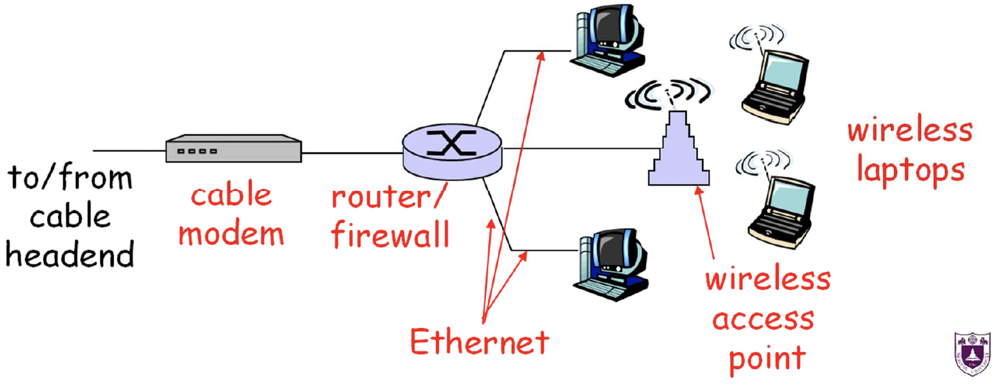
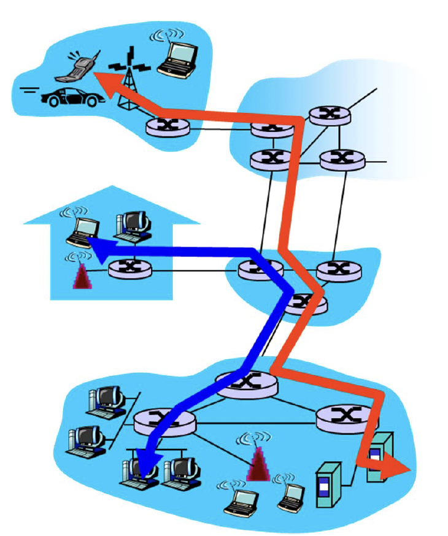
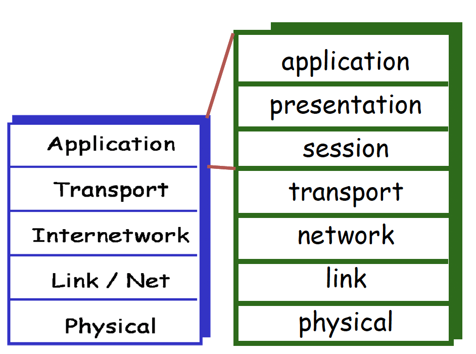
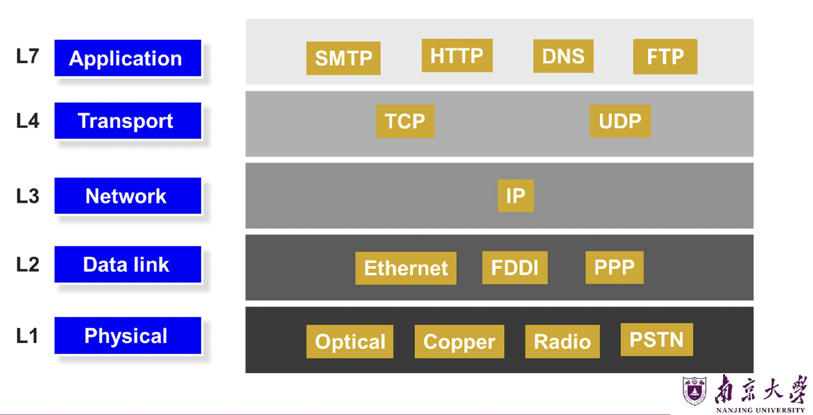
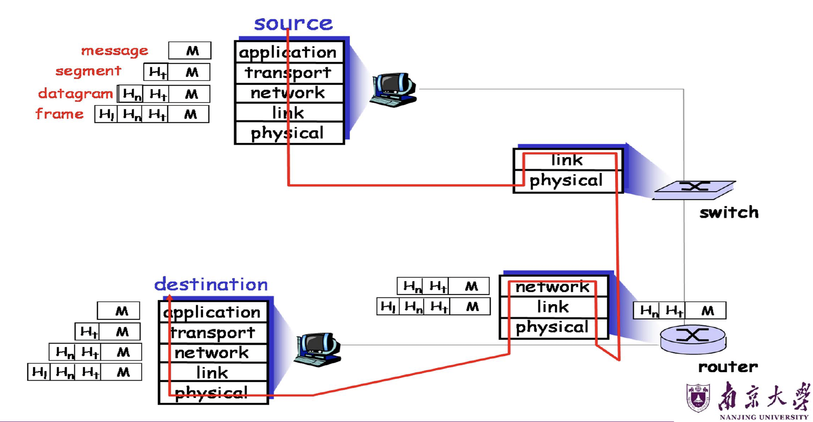
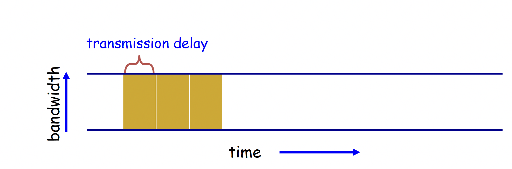
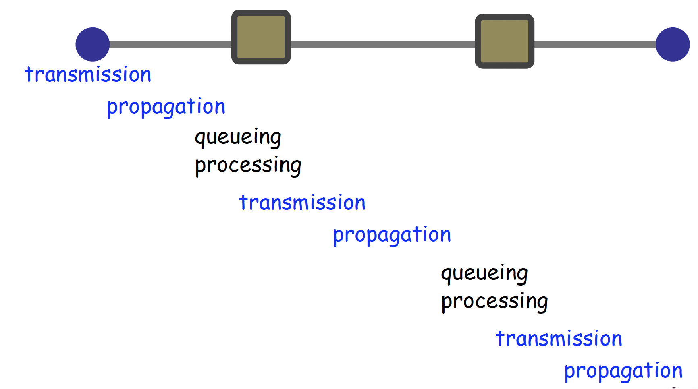

# 计算机网络与因特网

## 1. 课程定位与本讲范围

### 1.1 课程整体结构

本课程包含如下模块：

* 计算机网络和因特网
* 应用层
* 运输层
* 网络层：数据平面
* 网络层：控制平面
* 链路层和局域网
* 无线网络和移动网络
* 计算机网络中的安全
* 习题课和总复习

---

## 2. 计算机网络与互联网的基本概念

### 2.1 什么是网络（Network）

#### 核心定义

网络可以抽象定义为：

* 由若干“**节点**”组成
* 节点之间通过“**链路**”互连
* 用于在节点之间传递“**信息**”

---

### 2.2 什么是因特网（Internet）

#### 互联网的本质

互联网是：

* 一个**全球互联的计算机网络系统**
* 使用 **TCP/IP 协议族**
* 连接数十亿设备
* 本质上是一个“**网络的网络（network of networks）**”

---

## 3. 三个基本问题

* Q1：互联网由什么组成？

* Q2：如何接入互联网？

* Q3：数据如何在网络中传输？

---

## 4. 互联网的组成

### 4.1 组件视角（Component View）

从组件角度看，互联网由三大部分组成：

#### 1）端系统（Hosts / End Systems）

一般来说，Host（主机）指的是：
* “连接在网络边缘、能运行网络应用的设备”
* 通常有自己的网络地址（如IP），能发送/接收数据
* 既可以是客户端（手机、电脑），也可以是服务器（网站服务器、云主机）

End Systems(端系统)：
* 更强调它处在网络的“端点”（网络边缘）
* 端系统的主要特点是：运行网络应用（network applications），例如浏览器/微信/网盘/视频会议/游戏客户端、服务器端程序等

??? note "注意"
    根据上述的定义，Hosts = End system.

#### 2）通信链路（Communication Links）

用于连接设备和网络设备，可采用：光纤（Fiber）、铜缆(Copper)、无线电(Radio)、卫星(Satelite)

#### 3）路由器（Routers）

* 在不同物理网络之间**转发分组**
* 是互联网核心中的关键设备

??? warning "警告"
    只要负责把数据包从一个网络转发到另一个网络的设备，都叫路由器。这里所说的“路由器”更加侧重于在ISP中的路由器（网络核心），重点是高速转发、稳定性、冗余并且跑各种路由协议，一般不做NAT。
    
    而我们一般的家用路由器，位于网络边缘，是局域网通向ISP的网关，集成了:

    * NAT（地址转换）：把家里多台设备共享一个公网 IP（最典型差异）
    * DHCP：自动给家里设备分配内网 IP
    * 防火墙/简单安全策略
    * Wi-Fi 接入点（AP）
    * 以太网交换机（LAN 口其实是 switch 功能）
    * 有些还带 光猫/Modem（运营商一体机）

    需要区分。

---

### 4.2 服务视角（Service View）

从服务角度看，互联网是一种**通信基础设施**，为应用程序提供通信服务。

#### 支持的典型分布式应用

* Web、VoIP、电子邮件、在线游戏、电子商务、文件共享

#### 提供的通信服务类型

* 可靠数据传输
* 尽力而为（best effort）传输
* 有保证的时延与吞吐量

---

### 4.3 协议（Protocol）与标准

#### 协议
 
协议用于规定：

* 消息的**格式**
* 消息的**发送顺序**
* 消息接收后的**动作**
* 某些事件发生后的处理方式

网络中的所有通信活动都由协议控制。机器通信不是随意的，而是严格按协议执行。

常见网络协议：

* 应用层：HTTP、Skype
* 运输层：TCP
* 网络层：IP
* 链路层：PPP、Ethernet

#### 互联网标准组织

1. IETF

    * Internet Engineering Task Force
    * 负责制定互联网标准

2. RFC

    * Request for Comments
    * 互联网标准和技术文档的重要载体

??? info "说明"
    在网络中，**绝对可靠性**很难实现，现实网络系统通常追求：高概率可靠、可检测丢失、可重传恢复，而非数学意义上的绝对保证。

---

## 5. 接入互联网

互联网接入可分成三部分：**网络边缘（Network Edge）**、**接入网络（Access Networks）**、**网络核心（Network Core）**。

### 5.1 网络边缘（Network Edge）

* 定义：网络边缘是靠近用户和应用的一侧，主要由**End System/hosts**构成。

* 特点：运行应用程序、发起或接收通信。

#### 两种主要应用模型

##### 客户机/服务器模型（Client/Server）

由客户端发起请求，服务器长期在线提供服务，例子：

  * 浏览器 & Web 服务器
  * 邮件客户端 & 邮件服务器

##### 对等模型（P2P）

尽量少依赖专用服务器，节点之间直接交换资源，例子：Skype、BitTorrent

### 5.2 接入网络（Access Networks）

接入网络回答的是：**端系统如何连接到边缘路由器？**

接入网络的三大类:

* 家庭(Residential)接入网络
* 机构(Institutional)接入网络（学校、公司）
* 移动(Mobile)接入网络

#### 家庭接入网络

1）拨号接入（Dial-up）：通过调制解调器接入，速率可达 56 Kbps，传统方式，速度慢

2）DSL（数字用户线）：由电话公司部署、上行速率可到 1 Mbps、下行速率可到 8 Mbps，具有从家庭到电话局的**专用物理线路**。

3）HFC（混合光纤同轴）：由有线电视公司部署，非对称速率：

  * 下行可到 30 Mbps
  * 上行约 2 Mbps

多个家庭共享到 ISP 路由器的链路。

#### 公司 & 学校接入：局域网（LAN）

公司或大学中，通常通过**局域网（LAN）**将终端连接到边缘路由器。

一般使用以太网（Ethernet），支持速率包括：

* 10 Mbps
* 100 Mbps
* 1 Gbps
* 10 Gbps

终端通常接入到以太网交换机，再通过交换机骨干互联。

#### 无线接入网络

无线接入通过共享无线信道（基站 or “接入点”）将端系统连接到路由器，通常通过：

1）无线局域网（WLAN）

* 802.11b/g，即 WiFi
* 典型速率：11 Mbps / 54 Mbps

2）广域无线接入

* 由电信运营商提供
* 覆盖范围可达几十公里
* 速率约 1~10 Mbps
* 典型技术：3G、4G、LTE、WiMax

### 5.3 网络核心（Network Core）

网络核心是由路由器构成的网络架构，关注数据如何在网络中传输。

有两种交换模式：

* 电路交换：每次交换分配专用线路。
* 分组交换：主机将应用层分割成数据包，通过链路将数据包从路由器转发到路由器。

??? Waring "概念辨析"

    * 属于网络边缘的是：笔记本、手机、智能家居、服务器
    * 属于接入网络的是：双绞线、同轴电缆、无线路由器
    * 属于网络核心的是：路由器、交换机

---

## 6. 物理介质（Physical Media）

### 6.1 基本概念

bit: 在发送端和接收端之间传播的基本信息单位

physical link: 发送器与接收器之间的实际物理连接

#### 两大类物理介质

1）导引型介质（Guided Media）

信号沿着固体介质传播，例如：双绞线、同轴电缆、光纤。

* 双绞线：两根绝缘铜线缠绕组成，常用于以太网。典型类别有：
    * Cat5：100 Mbps / 1 Gbps
    * Cat6：10 Gbps

* 同轴电缆：两层同心铜导体，双向传输，支持宽带、多信道
* 光纤：使用玻璃纤维传输光脉冲，每个脉冲代表一个 bit，可达几十到上百 Gbps。优点：高速、低误码率、中继器间距大、抗电磁干扰

2）非导引型介质（Unguided Media）

信号自由传播，例如：无线电。

无线电使用电磁频谱传输，不需要实体导线，可双向通信，但是易受环境影响。

常见的无线链路类型：地面微波、无线 LAN（WiFi）、广域蜂窝通信、卫星通信

### 6.2 现代家庭网络示例

家庭网络常见组件包括：

* DSL 或 cable modem
* Router / Firewall / NAT
* Ethernet switch
* Wireless access point

<figure markdown="span">
{ width=60% }
</figure>

---

## 7. 网络核心与数据交换方式

### 7.1 网络核心（Network Core）

定义：网络核心是由**互联路由器组成的网状结构**

核心问题：数据如何穿过网络核心？

* 电路交换（Circuit Switching）
* 分组交换（Packet Switching）
* 虚电路（Virtual Circuit）

终端与网络通过交换设备连接，而不是彼此直接相连。这样做的好处是：

* 支持大规模扩展
* 若 $N$ 个节点两两直连，需要约 $N^2$ 条链路，代价过高

### 7.2 电路交换（Circuit Switching）

基本机制:

1. 源节点向目的节点发送**资源预约请求**
2. 交换设备进行**接纳控制**
3. 若通过，则建立专用电路
4. 数据沿该专用电路传输
5. 通信结束后拆除电路

特征：每条连接占用专用资源；性能可预测；一旦建立，交换简单快速。

优点：性能稳定、可预测；时延抖动小；对实时业务友好

缺点：建立和拆除电路复杂；专用资源浪费；对突发业务效率低；建立连接本身增加时延；交换机故障会导致相关电路失效。

??? tip "拓展"
    电路交换很适合光交换机。一般光交换机只做全光交换（因为光电交换从高速信号转化为低速信号会产生大量的发热，且电的速度实在是太慢），非常适合end to end.

---

### 7.3 分组交换（Packet Switching）

基本机制：

1. 主机把应用层消息切分成**分组（packets）**
2. 每个分组携带目的地址
3. 路由器逐跳转发
4. 分组在每一跳采用**存储-转发（store-and-forward）**方式前进

特征：每个分组独立处理、可共享网络资源、通过缓冲区吸收瞬时拥塞

优点：资源利用率高、实现较简单、具有更强鲁棒性、可绕过故障路径

缺点：性能不可预测、会产生排队时延、缓冲区满时会丢包、需要拥塞控制和缓冲管理

??? tip "拓展"
    分组交换很适合全电交换机。

### 7.5 拥塞、排队与丢失

#### 资源竞争（Resource Contention）

当多个流同时争用同一输出链路时，总需求可能超过可用资源。

#### 拥塞（Congestion）

表现为：分组在队列中等待；队列过长时可能溢出；从而发生丢包。

### 7.6 统计多路复用（Statistical Multiplexing）

定义：链路带宽采用“**按需共享**”的方式在多个用户之间分配。

思想：

1. 不为每个用户固定保留资源
2. 依赖“不是所有用户都会同时活跃”这一事实
3. 在多数时候可支持比固定分配更多的用户

代价：

1. 性能不可预测
2. 极端情况下会发生拥塞

??? info "例子"
    假设链路速率 10 Mbps，每个用户需求 1 Mbps，每个用户只有 10% 时间活跃。

    若用电路交换：最多支持 10 个用户。
    
    若用统计多路复用：可支持约 35 个用户，且有99.96%的概率每位用户仍可得到足够带宽。

### 7.7 虚电路（Virtual Circuit）

定义：虚电路可以看成是**电路交换 + 分组交换的结合**。

特征：

1. 路径预先固定
2. 数据仍以分组形式传输，仍需拥塞控制
3. 资源共享，可能保留一定资源
4. 需要建立和拆除连接

<figure markdown="span">
{ width=40% }
</figure>

### 7.8 三种交换方式比较

| 维度   | 电路交换      | 数据报分组交换 | 虚电路分组交换 |
| ---- | --------- | ------- | ------- |
| 传输通路 | 专用        | 非专用     | 非专用     |
| 传输方式 | 连续传输      | 分组传输    | 分组传输    |
| 带宽使用 | 固定        | 动态      | 动态      |
| 路由   | 固定        | 动态      | 固定      |
| 时延特点 | 只有呼叫建立时延 | 分组传输有时延 | 呼叫建立时延+分组传输时延  |
| 扩展性  | 差（接入用户有上限）| 好（用户数量可动态扩充） | 较好（用户数量可动态扩充，有拥塞控制保证服务质量）      |

## 8. 分层思想与协议体系

### 8.1 为什么要分层（Layering）

网络系统非常复杂，包含：主机、路由器、多种链路、应用、协议、硬件与软件。

因此需要一种清晰的组织方法。

分层的作用：

1. 给复杂系统建立明确结构
2. 便于识别各部分功能及相互关系
3. 提高模块化程度
4. 便于维护与升级
5. 某层实现改变时，尽量不影响其他层

---

## 9. OSI 参考模型

### OSI 模型简介

OSI 由 ISO 提出，是一个**七层模型**。然而推出较晚，未成为实际主流，现实中 TCP/IP 更成功

### OSI 七层及功能

#### 1）物理层（Physical Layer）

* 在链路上传输 bit
* 规定机械、电气、光学、接口特性，负责链路的建立、维持、撤销

??? tip "量纲辨析"
    物理层速率一定是b(bit)，应用层的速率才是（Byte）

#### 2）数据链路层（Data Link Layer）

* 将 bit 组织成帧（frame）
* 在直接相连节点间传输帧
* 链路管理、差错检测、重传控制、介质访问控制、流量控制

#### 3）网络层（Network Layer）

* 跨多个链路、多个网络传输分组
* 大规模地址体系
* 路由选择
* 转发
* 拥塞控制
* 若为面向连接网络，还涉及连接建立、维护、释放

#### 4）运输层（Transport Layer）

* 端系统之间的进程到进程通信
* 端到端数据传输
* 可靠传输、顺序保证、无重复、无丢失
* 连接管理

### 5）会话层（Session Layer）

* 应用之间对话控制、会话管理、检查点与恢复

### 6）表示层（Presentation Layer）

* 数据格式转换
* 编码、压缩、加密
* 机器无关表示

### 7）应用层（Application Layer）

* 用于为应用访问网络环境提供接口

??? info "INF0"
    会话层、表示层的很多功能在现实 TCP/IP 中通常并入应用层。

## 10. TCP/IP 协议体系

### TCP/IP 五层结构

应用层、运输层、网络层（Internetwork）、链路层、物理层

### 各层功能与典型协议

#### 1）应用层

用于支持网络应用

协议：FTP、SMTP、HTTP

#### 2）运输层

用于进程到进程的数据传输

协议示例：TCP、UDP

#### 3）网络层

在网络中数据包的路由传输

协议：IP、路由协议

??? waring "IP"
    网络层是唯一涉及多态转发的，所以网络层的协议一定要相同。

#### 4）链路层

邻居节点之间的数据传输

协议：PPP、Ethernet

#### 5）物理层

在线路上传输 **bit**

<figure markdown="span">
{ width=60% }
</figure>

---

## 11. 思想：IP是沙漏腰部

### 窄腰（Narrow Waist）

IP 位于中间狭窄处：

1. 上面可以承载多种应用层和运输层协议
2. 下面可以运行在多种链路和物理介质之上

这表明：

1. 任何支持 IP 的网络都能互通
2. 应用与底层网络技术解耦
3. 上下两侧都能自由创新

好处：网络互操作性极强、应用创新快、底层链路技术也可快速演进

代价：一旦 IP 本身要改动就很难！最典型的是，IPv4 向 IPv6 迁移困难

<figure markdown="span">
{ width=60% }
</figure>

---

## 12. 封装（Encapsulation）与协议数据单元（PDU）

发送端数据下传时，每一层都会在上层数据前面添加自己的控制信息（头部）。

例如：

1. 应用层消息
2. 加上传输层头部 → 段（segment）
3. 再加网络层头部 → 数据报（datagram）
4. 再加链路层头部 → 帧（frame）
5. 再通过物理层发送 bit

接收端则执行相反过程：**解封装**

<figure markdown="span">
{ width=75% }
</figure>

### PDU（协议数据单元）

不同层对其数据单元有不同称呼：

* 应用层：message
* 运输层：segment
* 网络层：datagram / packet
* 链路层：frame
* 物理层：bit

运输层头部可能包含:目的端口号、序号、差错检测码

---

## 13. 网络性能指标

三个核心性能指标：

* **时延（Delay）**
* **丢包（Loss）**
* **吞吐量（Throughput）**

### 时延（Delay）

定义：一个分组从源到目的地需要多长时间。

四种组成部分：

1. **传输时延（Transmission Delay）**
2. **传播时延（Propagation Delay）**
3. **排队时延（Queueing Delay）**
4. **处理时延（Processing Delay）**

#### 传输时延（Transmission Delay）

定义：把一个分组的所有比特“推入链路”需要的时间。

公式：

$$
\text{传输时延} = \frac{\text{分组长度}}{\text{链路传输速率}}
$$

影响因素：

* 分组越大，传输时延越大
* 速率越高，传输时延越小

<figure markdown="span">
{ width=75% }
</figure>

#### 传播时延（Propagation Delay）

定义：一个 bit 从链路一端传播到另一端所需的时间。

公式：

$$
\text{传播时延} = \frac{\text{链路长度}}{\text{传播速度}}
$$

影响因素：

* 距离越远，传播时延越大
* 传播速度通常接近光速但低于光速

??? tip "辨析"
    * 高带宽链路可显著降低传输时延
    * 但不能消除传播时延
    * 长距离链路即使带宽很高，传播时延仍存在

#### 排队时延（Queueing Delay）

定义：分组在缓冲区中等待被处理或发送的时间。

产生原因：

1. 瞬时到达流量超过链路处理能力
2. 出现资源竞争
3. 分组必须在队列中等待

影响因素：

* 到达速率
* 流量是否突发
* 输出链路速率

特点：最不稳定、最难精确预测、通常采用统计指标描述

常用统计描述：平均排队时延、时延方差、超过某一阈值的概率

#### 处理时延（Processing Delay）

定义

交换机、路由器处理一个分组所需的时间

特点：通常较小、很多场景下可视为可忽略

#### 端到端时延（End-to-End Delay）

一个分组经过多个节点时，总时延为各跳：处理时延、排队时延、传输时延、传播时延的叠加。注意，这里的叠加不是简单相加，因为**e2e的发送过程是流水线的**！

<figure markdown="span">
{ width=75% }
</figure>

### 丢包（Loss）

定义：发送到目的地的分组中，有多少比例在途中被丢弃。

原因：典型原因是队列缓冲区满；拥塞严重时丢包上升

### 吞吐量（Throughput）

定义：目的地主机从源主机接收数据的速率。

单链路场景下，若文件大小为 (F)，链路速率为 (R)，传输时间为 (T)，则平均吞吐量为：

$$
\text{吞吐量} = \frac{F}{T}
$$

在单条链路、传播时延影响较小时，平均吞吐量约等于链路速率 (R)。

#### 端到端吞吐量与瓶颈链路

在多跳路径中，端到端吞吐量通常由**最慢的一段链路**决定，即：

$$
\text{端到端吞吐量} = \min(R, R', ...)
$$

这就是**瓶颈链路（bottleneck link）**思想。

----

## 14. 排队论基础：Little 定律

用于分析排队时延。

### 基本术语

1. 到达过程

    * 平均到达速率：A
    * 峰值速率：P

2. 队列平均等待时间

    * (W)：waiting time

3. 队列平均长度

    * (L)：队列中平均分组数

### Little’s Law

公式：

$$
L = A \times W
$$

含义：队列平均长度 = 平均到达率 × 平均等待时间

由于有时更容易测量 (L)，可借助该公式推算 (W).