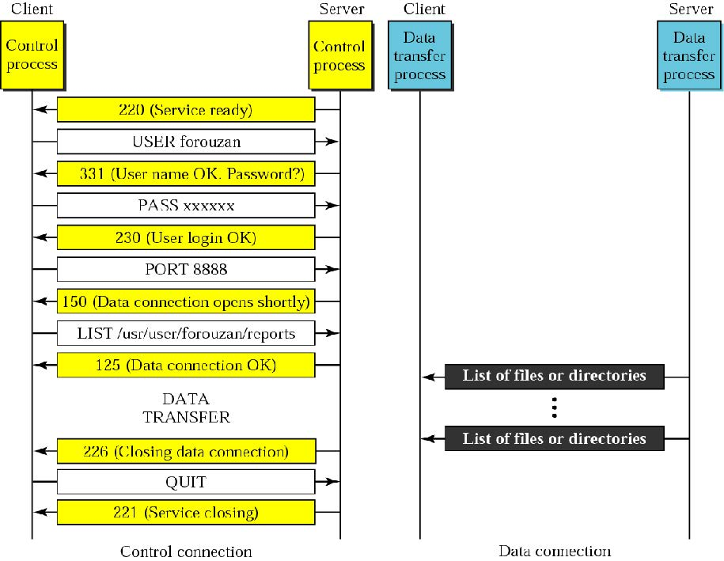
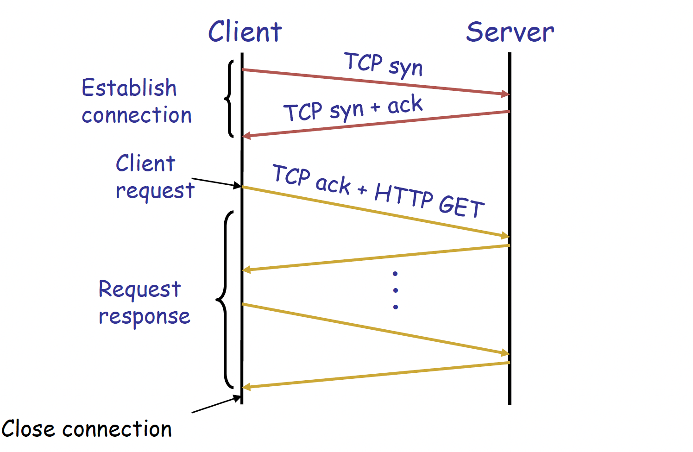

# 应用层（Application Layer）

---

## 一、互联网应用概述

### 1.1 应用（Application）

互联网应用本质上是运行在端系统（End Systems / Hosts）上的**通信进程（Communicating Processes）**，通过交换消息来实现应用功能。典型应用包括：电子邮件（Email）、Web、P2P文件共享、即时通讯（Instant Messaging）等。

### 1.2 应用层协议（Application-Layer Protocol）

应用层协议是应用的一个"代理（Agent）"，定义以下内容：

- **消息类型（Types）**：如请求消息（Request）与响应消息（Response）
- **消息语法（Syntax）**：消息中包含哪些字段，字段如何分隔
- **消息语义（Semantics）**：各字段信息的含义
- **规则（Rules）**：进程何时、如何发送与响应消息

应用层协议调用下层协议（TCP、UDP、RTP）提供的通信服务。

### 1.3 典型互联网应用与协议对照

| 应用 | 应用层协议 | 底层传输协议 |
|------|------------|--------------|
| 电子邮件 | SMTP [RFC 2821] | TCP |
| 远程终端访问 | Telnet [RFC 854] | TCP |
| Web | HTTP [RFC 2616] | TCP |
| 文件传输 | FTP [RFC 959] | TCP |
| 流媒体 | 私有协议（如RealNetworks） | RTP, RTSP, TCP or UDP |
| 网络电话 | 私有协议（如Dialpad） | SIP on UDP |

### 1.4 进程与用户代理

- **进程（Process）**：运行在主机内部的程序。同一主机上的进程通过操作系统定义的**进程间通信（IPC, Inter-Process Communication）**通信；不同主机上的进程通过应用层协议通信。
- **用户代理（User Agent）**：介于上层应用与下层网络之间的接口，实现用户界面与应用层协议。
  - Web：浏览器（Browser）、Web服务器（Web Server）
  - Email：邮件客户端（Mail Reader）、邮件服务器（Mail Server）
  - 流媒体：媒体播放器（Media Player）、媒体服务器（Media Server）

---

## 二、应用架构

### 2.1 客户端-服务器架构（Client-Server, CS）

| 角色 | 特征 |
|------|------|
| **Client** | 按需启动；主动发起连接，"先发言"；可以使用动态IP地址 |
| **Server** | 以守护进程（Daemon）方式常驻运行；提供服务；拥有固定（永久）IP地址 |

典型例子：Web（浏览器 vs Apache服务器）、Email（Outlook vs 邮件服务器）。

### 2.2 对等架构（Peer-to-Peer, P2P）

- 无常驻服务器；任意端系统之间直接通信
- 各节点（Peer）既是服务请求方，也是服务提供方 → **自扩展性（Self-Scalability）**：新节点带来新容量，也带来新需求
- 节点间歇性连接，IP地址动态变化 → 高可扩展但难以管理
- 典型例子：Gnutella、BitTorrent、Skype

### 2.3 混合架构（CS + P2P）

- **Skype**：VoIP P2P应用，集中式服务器用于发现对端地址，实际通话采用直接的客户端-客户端（Client-Client）连接
- **即时通讯（IM）**：聊天本身是P2P，集中式服务器负责用户在线状态检测（Presence Detection）与IP地址定位

---

## 三、域名系统（DNS, Domain Name Service）

### 3.1 DNS 功能

将人类可读的**域名（Domain Name）**映射为机器可处理的**IP地址（IP Address）**。例如：`www.baidu.com → 119.75.217.109`。它本质上是一个分布式数据库系统，按层级组织，由很多name server（域名服务器）共同组成。主机和 DNS 服务器之间通过应用层协议通信，来完成域名解析。

DNS还提供**负载均衡（Load Balancing）**：一个服务器域名可对应一组IP地址集合，这样能把请求分散到多台服务器上。

**为何不集中化DNS？** → 单点故障（Single Point of Failure）、流量瓶颈、远距离访问延迟、维护困难 → **无法扩展（Doesn't Scale）**

### 3.2 DNS 设计目标

- **唯一性（Uniqueness）**：无命名冲突
- **可扩展性（Scalability）**：支持大量名称与频繁更新
- **分布式自治管理（Distributed, Autonomous Administration）**：各域自主管理，无需追踪他人更新
- **高可用性（High Availability）**
- **快速查询（Fast Lookups）**
- **完美一致性是非目标（Non-goal）**：允许短暂不一致（TTL机制）

### 3.3 核心思想：三层次的层级结构（Hierarchy）

| 层级 | 描述 |
|------|------|
| **层级命名空间（Hierarchical Namespace）** | 树状结构，叶到根路径构成域名，如 `cse.eecs.umich.edu` |
| **层级管理（Hierarchically Administered）** | 每个区（Zone）对应一个行政管理机构，如 ICANN/IANA 管理根域，各组织管理自身子域 |
| **分布式服务器层级（Distributed Hierarchy of Servers）** | 分布式存储，非集中式 |

### 3.4 DNS 命名空间结构

- 顶层域名（TLD, Top-Level Domain）：`.edu`, `.com`, `.gov`, `.mil`, `.org`, `.net`, `.cn`, `.uk` 等
- 域（Domain）是子树，如 `.edu`、`umich.edu`、`eecs.umich.edu`
- 命名路径为从叶到根：`cse.eecs.umich.edu`
- 树深度任意（上限128层），命名冲突天然避免

### 3.5 DNS 服务器层级

| 服务器类型 | 职责 |
|------------|------|
| **根域名服务器（Root Name Server）** | 被无法解析名称的本地服务器访问；返回TLD服务器的IP映射；全球共13个根服务器集群 |
| **顶层域名服务器（TLD Server）** | 负责 `.com`, `.org`, `.net`, `.edu` 及国家顶级域；Network Solutions管理 `.com`，Educause管理 `.edu` |
| **权威DNS服务器（Authoritative DNS Server）** | 组织自有DNS服务器，它负责自己管辖范围内的域名信息，保存这些域名的 resource records（资源记录）；提供本组织内主机名到IP的权威映射（Authoritative Hostname-to-IP Mapping） |
| **本地DNS服务器（Local DNS Server）** | 不严格属于层级体系；ISP/企业/大学各自维护；也称"默认域名服务器"；有本地缓存（可能过期）；作为代理向层级体系转发查询 |

??? info "说明"
    只有前三层是在分级结构里面的。
    
    权威DNS服务器是决定你的流量流向哪一个ip。

    本地DNS服务器可用于加速映射，比如8.8.8.8(Google)。所有的域名解析都会先送往本地的DNS服务器，如果你的本地DNS服务器离你远的话，就会产生较大的延迟影响。

    总的来说，DNS 采用层次化查询机制。主机首先向本地 DNS 服务器发起查询；若本地缓存中没有结果，则本地 DNS 依次查询根服务器、顶级域服务器和权威 DNS 服务器；其中根服务器返回 TLD 服务器信息，TLD 服务器返回权威服务器信息，权威服务器返回目标主机名对应的 IP 地址。

### 3.6 DNS 名称解析（Name Resolution）

**迭代查询（Iterated Query）**（常见方式）：

1. 客户端[`cis.poly.edu`]向本地DNS服务器[`dns.poly.edu`]发送查询
2. 本地DNS → 根域名服务器（返回TLD服务器地址）
3. 本地DNS → TLD服务器（返回权威服务器地址）
4. 本地DNS → 权威DNS服务器[dns.cs.umass.edu]（返回最终IP）
5. 本地DNS返回IP给客户端[`gaia.cs.umass.edu`]

模式：**主机-服务器：递归查询；服务器-服务器：迭代查询**

??? warning "注意"

    1. 找root服务器不是本地主机找，是本地的DNS服务器找。
    2. DNS服务器之间的通信是一个迭代过程，不是一个递归过程；主机与本地DNS服务器之间是迭代过程。

### 3.7 DNS 资源记录（RR, Resource Record）

格式：`(name, value, type, ttl)`

| type | name | value |
|------|------|-------|
| **A** | 主机名 | IPv4地址 |
| **NS** | 域名 | 该域的权威DNS服务器主机名 |
| **MX** | 域名 | 邮件服务器主机名 |
| **CNAME** | 别名 | 规范主机名（Canonical Name） |

`name`表示的是域名，`ttl`表示可以缓存多久。

示例：
- `(networkutopia.com, dns1.networkutopia.com, NS, 32768)`
- `(dns1.networkutopia.com, 212.212.212.1, A, 5600)`

> 由上表，存在把域名和权威DNS服务器之间的映射，不一定是域名和ip地址之间的映射，这个取决于`type`。

### 3.8 DNS 协议

- 查询`Query`与响应`Reply`消息使用**相同格式**：包含 Header: identifier, flags；Plus resource records

- 默认使用 **UDP(User Datagram Protocol)，端口53**（协议规范也支持TCP，但多数场景还是UDP）

### 3.9 DNS 可靠性机制

- **主/辅DNS服务器复制（Primary/Secondary Replication）**：至少一个副本存活即可提供服务；查询可在副本间负载均衡
- **使用UDP协议**：UDP 本身不保证可靠传输，所以如果想更可靠，就要靠 DNS 自己补机制
- **超时后尝试备用服务器**；重试同一服务器时采用**指数退避（Exponential Backoff）**[即：重试间隔会逐渐变长]
- 所有查询使用**相同标识符**：不关心哪台服务器响应，只要有一个正确回应就行

### 3.10 DNS 缓存（Caching）

- 查询带来最多约1秒延迟 → 缓存可大幅降低开销
- DNS服务器缓存查询响应，响应中包含 **TTL（Time to Live）** 字段，TTL过期后删除缓存条目
- 顶级服务器极少变化；热门网站（如`www.cnn.com`）经常已被本地缓存

### 3.11 DNS 攻击

- **DDoS(Distributed Denial of Service)攻击**：向根服务器或TLD服务器发送大量请求（2002年10月曾发生对13个根服务器发送大量ICMP报文洪水攻击，因本地缓存、分组过滤阻止ICMP报文等机制未奏效）
- **重定向攻击（Redirect Attacks）**：

    1. 中间人攻击（Man-in-the-Middle）：攻击者截获 DNS 查询，返回假的结果，让主机访问到错误的网站
    2. **DNS投毒（DNS Poisoning）**：向DNS服务器发送伪造响应并使其缓存，造成多次导向错误地址 → DNS污染（解决方案：修改host文件）

- **利用DNS实施DDoS放大攻击（DNS Amplification）**：伪造源地址（目标IP）发送查询，DNS响应大量涌向目标IP。此时的DNS成为“攻击工具”。

---

## 四、电子邮件（Electronic Mail）

### 4.1 主要协议

| 协议 | 全称 | 功能 |
|------|------|------|
| **SMTP** | Simple Mail Transfer Protocol | 传递纯文本邮件（发送） |
| **MIME** | Multipurpose Internet Mail Extension | 传递多媒体内容（图片、音视频等） |
| **POP3** | Post Office Protocol v3 | 邮件从服务器取回（含授权与下载） |
| **IMAP4** | Internet Mail Access Protocol v4 | 在服务器上操作存储的邮件 |

### 4.2 邮件系统组件

- **用户代理（User Agent）**：撰写、编辑、阅读邮件（如 Outlook, Foxmail）；收发邮件存储于服务器
- **邮件服务器（Mail Server / Host）**：
    1. **邮箱（Mailbox）**：存储用户收到的邮件
    2. **消息队列（Message Queue）**：存储待发送邮件
    3. 服务器间使用 **SMTP协议** 传递邮件

### 4.3 邮件投递三阶段

| 阶段 | 描述 |
|------|------|
| **第一阶段** | 本地用户代理（SMTP Client）→ 本地SMTP服务器（SMTP Server） |
| **第二阶段** | 本地SMTP服务器（此时作SMTP Client）→ 远程SMTP服务器（SMTP Server） |
| **第三阶段** | 远程用户代理通过邮件访问协议（POP3 / IMAP4 / HTTP）从远程服务器取回邮件 |

### 4.4 SMTP 协议详解

- 规范：**RFC 821**标准；使用 **TCP，端口25**；**直接传输（Direct Transfer）**：从客户端直接传到服务器
- 需要邮件信封信息（即消息头部，比如发件人、收件人）；可在消息头中添加路径日志
- **不规定邮件内容格式**（内容格式由 RFC 822 / MIME 定义）；消息必须为 **7-bit ASCII**

**SMTP 三阶段传输（Transaction）**：

1. **握手（Handshaking / Greeting）**
2. **数据传输（Transfer of messages data）**
3. **关闭连接（Close connection）**

交互模式：命令（ASCII文本）/ 响应（状态码 + 短语），例如：
```
$ telnet servername 25
S: 220 hamburger.edu
C: HELO crepes.fr
S: 250 Hello crepes.fr, pleased to meet you     //Handshaking
C: MAIL FROM: <alice@crepes.fr>
C: RCPT TO: <bob@hamburger.edu>
C: DATA
C: Do you like ketchup? ...
C: .                                            // input data
S: 250 Message accepted for delivery            // transfer data
C: QUIT                                         
S: 221 hamburger.edu closing connection         // close
```

**SMTP可靠性**：基于TCP提供可靠传输；但无法保证恢复丢失邮件；对发件人无端到端确认(能保证邮件到达对方的服务器，但不保证对方看到)；错误通知仅指示到达主机，不保证送达用户邮箱；总体被视为可靠。

### 4.5 邮件消息格式（RFC 822）

两部分格式：
- **头部（Header）**：`keyword: value` 格式，如 `From:`, `To:`, `Cc:`, `Subject:`, `Date:`
- **正文（Body）**：纯文本内容，仅ASCII字符
- 头部与正文以**空行**分隔；邮件以两个 `<CRLF>` 结束

**邮件地址格式**：`mailbox@SMTP_Server`，其中 mailbox 是SMTP服务器上的邮箱名，SMTP_Server 是DNS名或IP地址。

### 4.6 MIME

- **Multipurpose Internet Mail Extension**
- 扩展并自动化编码机制；允许在单封邮件中包含多种独立组件（程序、图片、音频、视频）
- 与现有邮件系统兼容（全部编码为7-bit ASCII，非MIME客户端忽略MIME头部）；可扩展

**MIME 5个新邮件头字段**：

| 字段 | 作用 |
|------|------|
| MIME-Version | MIME版本号 |
| Content-Type | 内容类型（如 `image/jpeg`, `multipart/mixed`） |
| Content-Transfer-Encoding | 编码方式（如 `base64`） |
| Content-Id | 内容标识符 |
| Content-Description | 内容描述 |

### 4.7 邮件访问协议

| 协议 | 特点 |
|------|------|
| **POP3** | 授权（user/pass）+ 下载（list/retr/dele/quit）；"下载后删除"或"下载保留"模式；**跨会话无状态（Stateless）** |
| **IMAP4** | 邮件保留在服务器（单一位置）；支持文件夹操作；**跨会话维护状态**（文件夹名、消息状态等） |
| **HTTP** | Gmail、Hotmail、Yahoo等Web邮件系统使用 |

### 4.8 POP3

POP3（Post Office Protocol version 3）用于从邮件服务器中下载邮件。

**工作过程**

1. 认证阶段（Authorization phase

    客户端使用以下命令登录服务器：

    `USER`：输入用户名  
    `PASS`：输入密码  

    服务器返回两种典型结果：

    `+OK`：登录成功  
    `-ERR`：登录失败  

2. 事务阶段（Transaction phase）
    登录成功后，客户端可以对邮件进行操作：

    `LIST`：列出邮件编号  
    `RETR`：按编号读取邮件  
    `DELE`：删除邮件  
    `QUIT`：退出连接  

POP3 更强调“把邮件取到本地”。常见使用方式有两种：

1. **download and delete**：把邮件下载到本地后，从服务器删除。
2. **download and keep**：把邮件下载到本地，同时在服务器保留副本。

POP3 跨会话通常不保存太多状态，因此不擅长同步以下信息：已读/未读；是否回复；邮件文件夹；删除状态。 因此POP3协议适合单设备收邮件，或者主要希望把邮件保存在本地的场景。

### 4.9 IMAP4
IMAP4（Internet Mail Access Protocol version 4）用于在服务器上访问和管理邮件。其核心思想是邮件主要保存在服务器端，不同设备访问的是同一份邮件数据。

IMAP4 支持在服务器上直接管理邮件，例如：文件夹管理；多设备同步；保存邮件状态；记录已读、已回复、已删除等信息。

它还能保存跨会话状态，例如：文件夹名称；邮件与文件夹的对应关系；邮件当前状态 。 
 
因此IMAP4适合手机、电脑、平板等多个设备同时使用同一个邮箱的情况。

| 协议 | 核心特点 | 邮件主要存放位置 | 状态/文件夹管理 | 适用场景 |
|------|----------|------------------|-----------------|----------|
| **POP3** | 以“接收并下载邮件”为主，客户端通常把邮件取回本地后阅读和管理 | 本地为主；服务器端可选择保留副本或下载后删除 | 较弱。通常不维护完整的跨设备状态，不擅长同步已读、删除、文件夹等信息 | 主要在单设备上收邮件，或希望把邮件长期保存在本地 |
| **IMAP4** | 以“在服务器上访问和管理邮件”为主，各设备访问的是同一份邮箱数据 | 服务器为主 | 较强。支持文件夹、已读/未读、回复、删除等状态的统一管理与同步 | 多设备同时使用同一邮箱，需要统一管理邮件状态 |

---

## 五、文件传输协议（FTP, File Transfer Protocol）

### 5.1 基本特性

- 规范：**RFC 959**；使用 **TCP，控制端口21，数据端口20**
- 客户端/服务器模型，由客户端发起传输（上传或下载）。用户并不是直接操作服务器文件系统，而是通过 FTP 客户端向服务器发送命令。
- 处理异构操作系统与文件系统（Heterogeneous OS and File Systems），即跨平台文件传输
- 需要对远程文件系统进行访问控制，有权限管理

### 5.2 控制连接与数据连接

FTP 使用**带外（Out-of-Band）**控制连接，即控制信道与数据信道分离：

| 连接类型 | 端口 | 说明 |
|----------|------|------|
| **控制连接（Control Connection）** | 21 | 持久存在于整个会话；传递命令与响应，用于客户端在控制连接上完成认证、浏览目录（通过命令完成）|
| **数据连接（Data Connection）** | 20 | 每次文件传输时由服务器向客户端开启；传完即关闭 |

- FTP服务器维护**用户状态（User State）**：当前目录、认证信息，所以FTP被成为有状态协议（stateful）

<figure markdown="span">
{ width=80% }
</figure>

### 5.3 常用命令与响应码

**命令（ASCII文本，经控制信道传送）**：`USER`、`PASS`、`LIST`、`RETR filename`、`STOR filename`

**响应码示例**：

- `331` — 用户名OK，需要密码
- `125` — 数据连接已打开，开始传输
- `425` — 无法打开数据连接
- `452` — 写文件出错

---

## 六、万维网（World Wide Web，WWW）与HTTP（Hyper Text Transport Protocol）

### 6.1 WWW 历史

- **1990年**：Tim Berners-Lee 在CERN发明首个HTTP实现
- **HTTP/0.9 (1991)**：仅支持简单GET命令
- **HTTP/1.0 (1992)**：客户端/服务器信息、简单缓T

- **HTTP/1.1 (1996)**：性能与安全优化（持久连接、流水线等）
- **HTTP/2 (2015)**：通过单TCP连接的请求多路复用（Request Multiplexing）、二进制协议、服务器推送（Server Push）

### 6.2 Web 三大组件

- **基础设施（Infrastructure）**：客户端、服务器（DNS、CDN、数据中心）
- **内容（Content）**：URL（命名内容）、HTML（格式化内容）
- **协议（Protocol）**：HTTP

### 6.3 URL（Uniform Resource Locator）

格式：`<protocol>://<host>:<port>/<path>?query_string`

- **protocol**：传输或解释对象的方法，如 `http`, `ftp`, `Gopher`
- **host**：对象所在主机的DNS名或IP地址
- **port**：端口号，表示服务运行的入口
- **path**：包含对象的文件路径名
- **query_string**：以键值对形式发送给服务器应用的参数

示例：`http://www.nju.edu.cn:8080/somedir/page.htm`

### 6.4 HTTP 协议特性

- **客户端-服务器架构**：服务器常驻（Always-On）且地址固定；客户端主动发起连接，服务器返回响应
- **同步请求/响应协议（Synchronous Request/Reply）**：运行于 **TCP，端口80**
- **无状态（Stateless）**：每次请求-响应独立处理，服务器不保留用户状态
- **ASCII格式**早期 HTTP/1.x 在 HTTP/2 之前主要是文本格式

### 6.5 HTTP 请求/响应流程

<figure markdown="span">
{ width=60% }
</figure>

### 6.6 HTTP 方法类型（HTTP/1.1）

| 方法 | 功能 |
|------|------|
| **GET** | 请求获取指定资源 |
| **HEAD** | 类似GET，但只返回头部（无Body） |
| **POST** | 提交数据（如Web表单） |
| **PUT** | 上传文件到URL指定路径 |
| **DELETE** | 删除URL指定的文件 |

### 6.7 HTTP 消息格式

**请求消息（Request Message）**：
```
GET /somedir/page.html HTTP/1.1      ← 请求行（方法 + 资源 + 版本）
Host: www.someschool.edu             ← 头部行
User-agent: Mozilla/4.0
Connection: close
Accept-language: fr
                                     ← 空行（CRLF，表示消息结束）
```

**响应消息（Response Message）**：
```
HTTP/1.1 200 OK                      ← 状态行（版本 + 状态码 + 状态短语）
Connection: close                    ← 头部行
Date: Thu, 06 Jan 2017 12:00:15 GMT
Server: Apache/1.3.0 (Unix)
Last-Modified: Mon, 22 Jun 2006 ...
Content-Length: 6821
Content-Type: text/html
                                     ← 空行
data data data data data ...         ← 数据（如请求的HTML文件）
```

### 6.8 HTTP是无状态协议

**优点（服务器端可扩展性更好）**：

- 故障处理更简单，某台服务器挂了，换另一台处理请求也比较方便。
- 可处理更高请求速率，因为每个请求都独立。
- 请求顺序无关。因为当前的请求不强依赖“上一条请求的状态”。

**缺点（某些应用需要持久状态）**：

- 需要唯一识别用户或存储临时信息
- 如：购物车（Shopping Cart）、用户画像（User Profiles）、使用追踪（Usage Tracking）

### 6.9 Cookie：在无状态协议中维护状态

**原理**：客户端侧状态维护（Client-Side State Maintenance）

- 服务器在响应中设置 `Set-Cookie: XYZ`
- 客户端存储Cookie
- 后续请求携带 `Cookie: XYZ` 发送给服务器
- 服务器据此识别用户，访问后端数据库

**Cookie 的应用**：授权（Authorization）、购物车、推荐系统、Web邮件会话状态

**Cookie 与隐私**：服务器可借此大量了解用户行为；搜索引擎可跨站获取用户信息；被劫持的浏览器可能滥用Cookie。

### 6.10 HTTP 性能分析

定义**RTT（Round-Trip Time）**表示小分组从客户端到服务器再返回的时间。

单次对象响应时，由6.5，需要1个RTT用于TCP建立，1个RTT用于HTTP请求与首字节响应，接着再进入数据传输。因此单次对象响应时间为：

$$Total = 2RTT + Transmission~Time$$

就算传输的对象很小，但是网络延时很高，$RTT$过大，HTTP也会显得特别慢。

1. **获取n个小对象（$\Delta$为传输时间）**：

    | 策略 | 时间复杂度 | 说明 |
    |------|------------|------|
    | 非持久连接，逐个获取（HTTP/1.0默认） | $2(n + 1)\cdot RTT + \Delta$ | 每次要先拿HTML框架再进行对象的传输；每个对象新建TCP连接，开销大 |
    | 并发连接（$m$条并行） | $\sim 2⌈n/m⌉ \cdot RTT$ | 网络侧不友好（TCP公平性问题） |
    | 持久连接（HTTP/1.1默认） | $\sim (n+2) \cdot RTT$ | 复用同一TCP连接；底层可学习RTT和带宽特性 |
    | 流水线（Pipelined） | $\sim 3 \cdot RTT$| 批量请求，减少包数量；多个请求可置于一个TCP段 |
    | 流水线 + 持久（最优） | 首次$\sim 3\cdot RTT$，后续$\sim 1\cdot RTT$ | HTTP/1.1推荐方式 |

2. **获取n个大对象（每个大小为F）**：

    | 方式 | 时间近似公式 | 适用理解 | 说明 |
    |---|---|---|---|
    | one-at-a-time | $\sim nF / B$ | 顺序下载 $n$ 个大对象 | 总数据量是 $n \times F$，带宽是 $B$，所以总时间约等于总数据量除以带宽 |
    | m concurrent| $\sim \lceil n/m \rceil \times F / B$ | 每轮并发下载 $m$ 个对象 | 大约分成 $\lceil n/m \rceil$ 轮，每轮传一批对象；假设每个 TCP 连接都能分到差不多的带宽，本质上是多路使得总带宽增加。 |
    | pipelined and/or persistent | $\sim nF / B$ | 连接复用，但瓶颈仍是带宽 | 对大对象来说，主要耗时在传数据本身，减少 RTT 和建连开销帮助不大 |

    > 由此可见，对于大对象下载，HTTP 性能主要受带宽限制。持久连接和流水线对这种场景帮助不大；真正显著改善速度的，要么是并发拿更多带宽，要么就是直接提升链路带宽。


思考：以下三种传输的用时是多少，瓶颈是什么：

1. $F = 100Mb, B = 100Mbps$：$1s$
2. $F = 1Kb, B = 1Gbps$：肯定比1微秒高，因为瓶颈在$RTT$
3. $F = 1000Gbps, B = 400 Gbps$：肯定比$2.5s$高，因为瓶颈在端侧I/O读写

> 一般好的网络：e2e传输速度在400兆，$RTT$在毫秒级。

### 6.11 缓存（Caching）

**工作原理**：利用**引用局部性（Locality of Reference）**；缓存有效性随缓存容量对数增长，这表明缓存的边际效应递减。

**HTTP缓存机制（If-Modified-Since）**：

用于客户端主动请求服务器。

- 客户端在GET请求中携带 `If-modified-since: <time>`
- 服务器比对资源的 `Last-Modified` 时间(cache revalidation机制)：
    1. 未修改 → 返回 `304 Not Modified`（无Body，节省带宽）
    2. 已修改 → 返回 `200 OK` + 最新资源

例如：
```
GET /somedir/page.html HTTP/1.1
Host: www.someschool.edu
User-agent: Mozilla/4.0
If-modified-since: Wed, 18 Jan 2017 10:25:50 GMT
```

**响应头缓存控制**：

服务器也能主动通过响应头声明缓存策略。

- `Expires`：指定资源缓存的安全期限，表示在此时间之前，缓存副本可以被认为是“新鲜的（fresh）”，例如： 
    ```
    Expires: Wed, 24 Jan 2025 12:00:00 GMT
    ```

- `No-cache`：忽略所有缓存，始终从服务器获取最新资源

**缓存部署位置**：

| 位置 | 类型 | 特点 |
|------|------|------|
| 浏览器本地 | 客户端缓存 | 个人级别 |
| ISP/企业边界 | **正向代理（Forward Proxy）** | 靠近客户端；减少网络流量和延迟；由ISP或企业部署 |
| 内容提供方边界 | **反向代理（Reverse Proxy）** | 靠近服务器；降低源服务器负载；由内容提供方部署 |
| 分布式节点 | **内容分发网络（CDN）** | 全球分布，综合以上优势 |

| 对比项     | Reverse Proxy  | Forward Proxy      |
| ------- | -------------- | ------------------ |
| 位置      | 靠近服务器          | 靠近客户端              |
| 部署对象     | 内容提供方          | ISP / 企业 / 组织      |
| 主要目标    | 降低源站负载、保护后端    | 降低网络流量、减少客户端延迟     |
| 客户端是否感知 | 通常无感知，直接把它当服务器 | 客户端通常需要配置或处于代理网络后  |
| 典型用途    | 网站加速、负载均衡、源站保护 | 企业出口代理、校园网缓存、运营商缓存 |

---

## 七、内容分发网络（CDN, Content Distribution Networks）

### 7.1 背景与挑战

- 从单一源服务器实时流式传输大型文件（如视频），大文件实时传输压力很大
- 保护源服务器免受 DDoS 攻击
- 海量用户并发导致服务器与网络过载

### 7.2 CDN 解决方案

1. 在全球**数百台服务器**上复制（Replicate）内容，**CDN分发节点（Distribution Node）**协调内容分发
2. 将内容放置在**靠近用户**的位置（Placing Content Close to User）
3. 内容提供商（Origin Server）是CDN的客户（Customer），CDN将客户内容复制到CDN服务器；内容更新时CDN同步更新
4. 由CDN本身的权威DNS服务器完成重定向

### 7.3 CDN 支撑技术

| 技术 | 说明 |
|------|------|
| **DNS（负载均衡）** | 一个域名映射多个IP地址 |
| **内容路由（Content-Based Routing）** | 将请求路由到最近的CDN服务器 |
| **URL重写（URL Rewriting）** | 将 `http://www.sina.com/sports/tennis.mov` 重写为 `http://www.cdn.com/www.sina.com/sports/tennis.mov` |
| **重定向策略（Redirection Strategy）** | 综合考虑负载均衡、网络延迟、缓存/内容局部性 |

### 7.4 CDN 工作流程

1. **URL重写**：获取CDN权威服务器地址
2. 向CDN权威DNS服务器查询，获取**最近CDN服务器IP**
3. **预热CDN缓存（Warm Up CDN Cache）**：CDN服务器从源服务器拉取内容
4. 客户端直接从**CDN服务器**获取页面/媒体

### 7.5 CDN 重定向机制

- CDN构建**网络拓扑图（Map）**，标注各叶ISP与CDN服务器之间的距离
- DNS查询到达权威DNS服务器时：

    1. 服务器识别查询来源ISP
    2. 使用Map确定最佳CDN服务器

- CDN服务器形成一个**应用层覆盖网络（Application-Layer Overlay Network）**

---

## 八、Web 性能优化总结

| 目标 | 方案 |
|------|------|
| 协议层面 | 改进HTTP（持久连接、流水线、HTTP/2多路复用）、改进TCP |
| 缓存与复制 | 正向代理缓存、反向代理缓存、CDN、浏览器缓存 |
| 基础设施 | 利用规模经济（Economies of Scale）：Web托管、CDN、数据中心 |
