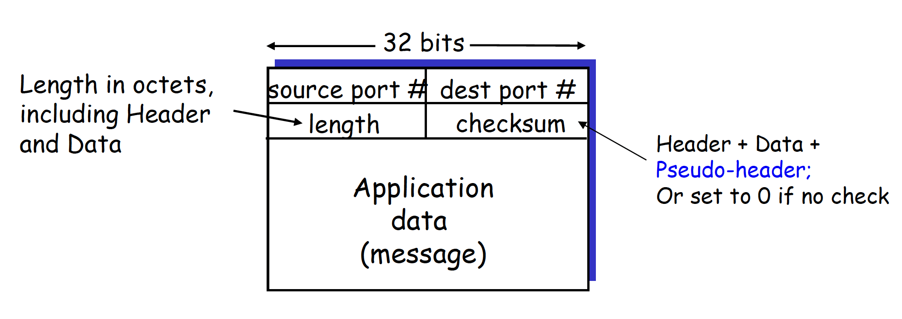
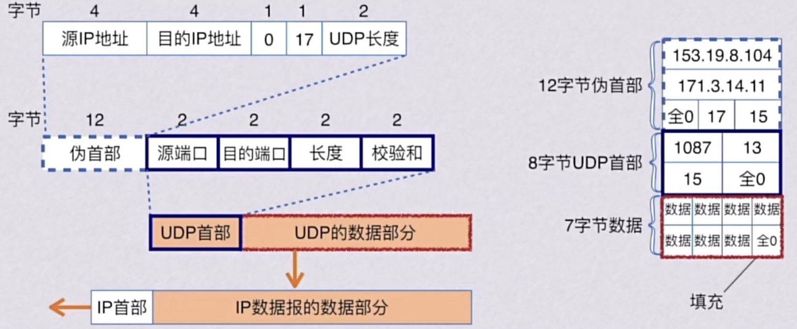
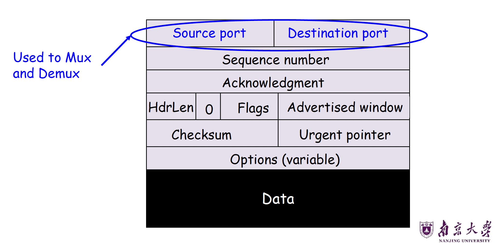
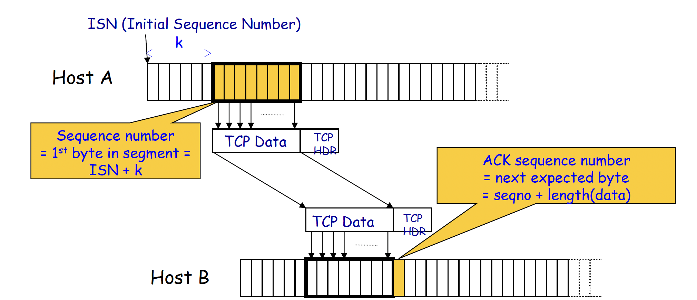
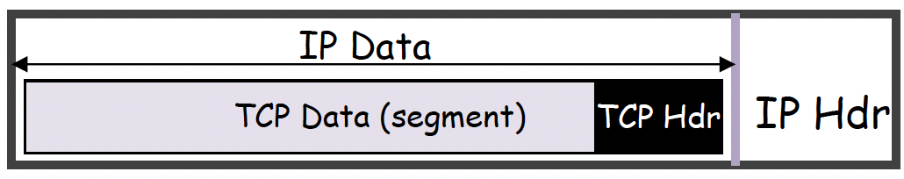
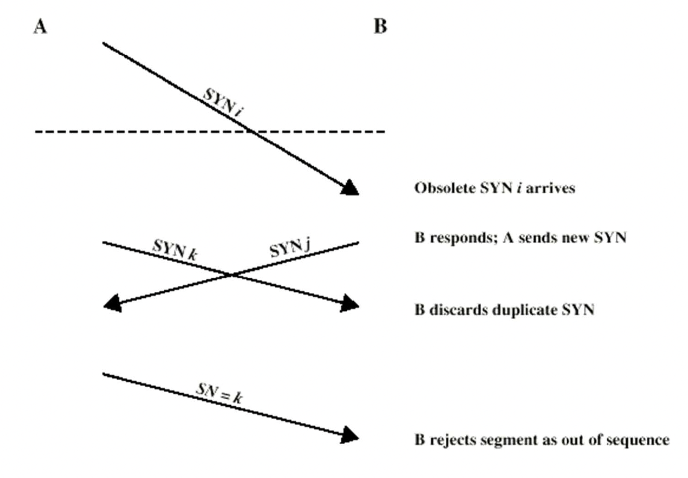
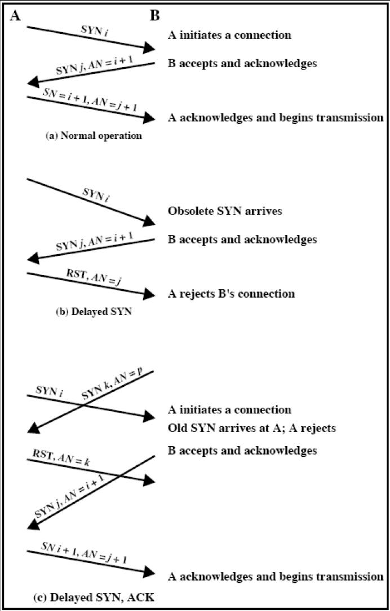

# 运输层 Part2

---

## 一、UDP：用户数据报协议（User Datagram Protocol）

### 1.1 UDP 概述

UDP 是一种**轻量级的进程间通信协议**，定义于 RFC 768（1980年），是互联网协议栈中最基础的传输层协议之一。其核心设计理念是**避免可靠传输所带来的额外开销与延迟**。

UDP 使用**目的 IP 地址 + 端口号**来支持多路分解（Demultiplexing），将数据报正确交付至目标进程。

---

### 1.2 UDP 的特性

#### "尽力而为"服务（Best-Effort Service）
UDP 报文段可能出现以下情况：

- **丢失（Lost）**：数据报在网络传输中被丢弃
- **乱序到达（Out-of-Order Delivery）**：报文段不按发送顺序到达应用层

#### 无连接性（Connectionless）

- 发送方与接收方之间**无需握手**（No Handshaking）
- 每个 UDP 报文段被**独立处理**，彼此之间没有状态关联

---

### 1.3 为什么存在 UDP？

UDP 存在的合理性体现在以下四个方面：

| 优势 | 说明 |
|------|------|
| **无连接建立开销** | 无需三次握手，避免引入额外延迟 |
| **简单性** | 发送方和接收方均无需维护连接状态 |
| **首部开销小** | UDP 首部仅 8 字节，远小于 TCP 的 20 字节 |
| **无拥塞控制** | 发送方可以以任意期望速率发送数据，适合实时应用 |

---

### 1.4 UDP 的典型应用场景

- **流媒体应用**（Streaming Multimedia Apps）：对丢包有一定容忍性，对速率敏感
- **DNS**：查询-响应模型，短小快速
- **SNMP**（简单网络管理协议）

---

### 1.5 UDP 报文段格式

<figure markdown="span">
{ width=60% }
</figure>

各字段说明：

- **源端口号（Source Port，16 bit）**：可选字段，发送方端口，便于接收方回复
- **目的端口号（Destination Port，16 bit）**：必填，用于多路分解
- **长度（Length，16 bit）**：以字节（Octet）为单位，包含首部和数据部分的总长度，最小值为 8（仅首部）
- **校验和（Checksum，16 bit）**：可选错误检测字段；若设为 0，表示不进行校验。一般在IPv4中可以选择不进行校验，在IPv6中必须校验。注意，Checksum要覆盖UDP Header、UDP data以及**Pseudo-Header**.

由此可见，UDP的Header共64bit.

??? info 说明
      UDP 里有些字段和机制不是强制依赖的。校验和可以关掉，表示不做差错检查；源端口也可以不写，因为源端口的作用只是源端口在某些场景下如果接收方如果想回消息，就可以根据这个源端口回给发送方。这体现了 UDP 是一个简单、轻量、不强调可靠性的协议。

---

### 1.6 UDP 伪首部（Pseudo-Header）

**伪首部**不是UDP真正的首部，不会作为UDP交给应用层，也不是UDP实际格式的一部分。他只是在发送方计算校验和、接收方验证校验和的时候临时加上。

它的作用是让 UDP 校验和不仅检查 UDP 自己的数据，还顺便检查一些和 IP 层有关的重要信息，避免报文送错地方却没被发现。

<figure markdown="span">
{ width=80% }
</figure>

??? warning 注意

      1. 上述的17表示UDP，因为UDP在IP层的协议号是17.
      2. 如图，由于计算Checksum是按16bit分组，如果数据只有7字节，必须再补一个全0的字节。

> **关键点**：伪首部并非 UDP 数据报的真正组成部分，仅在计算校验和时临时添加，既不向下传送也不向上递交。这与 IP 不同——**UDP 对首部和数据部分一起做校验，而 IP 的校验和只检测首部**。

---

### 1.7 UDP 校验和计算方法

**发送方**：

1. 将报文段内容（含首部、伪首部字段）视为一系列 **16 位整数**
2. 对所有 16 位字进行**反码求和**（One's Complement Sum）
3. 如果产生进位，就做回卷加法（wraparound）
4. 将求和结果取反（反码）作为校验和写入字段

**接收方**：

1. 根据 IP 首部里的源 IP、目的 IP、协议号、UDP 长度，重新构造伪首部
2. 拼接伪首部、首部以及数据，重新计算接收到报文段的校验和
3. 验证：计算值与校验和字段之**和是否全为 1（1111...1111）**

      - 若**否**：检测到错误（Error Detected）
      - 若**是**：未检测到错误（但可能仍存在未检出的错误）

**进位回卷（Wraparound）**：求和时若最高位产生进位，需将进位加到结果的最低位。

---

## 二、TCP：传输控制协议（Transmission Control Protocol）

### 2.1 TCP 提供的抽象

TCP 为应用层提供**可靠的、有序的、字节流**传输服务：

- **可靠性（Reliable）**：TCP 会重传丢失的数据包（递归重传），直至放弃并关闭连接
- **有序性（In-Order）**：TCP 只向应用层交付连续的数据块，不会跳过中间缺失的数据(注意：这里的有序性是指向应用层交付的连续性，而不是到达receiver的顺序)
- **字节流（Byte Stream）**：TCP 假设存在一个持续的传入数据流，并尽力将其完整交付给应用层，不保留消息边界

> 虽然底层网络会丢包、乱序、重复、出错，但 TCP 会把这些复杂性藏起来，让应用感觉自己拿到的是一条稳定的数据流。

---

### 2.2 TCP 复用已有机制

TCP 综合运用了以下已学的可靠传输机制：

| 机制 | 说明 |
|------|------|
| **校验和（Checksum）** | 检测传输错误 |
| **序列号（Sequence Numbers）** | 以字节偏移量（Byte Offsets）为单位，非数据包 ID |
| **滑动窗口（Sliding Window）** | 发送方和接收方均维护滑动窗口 |
| **累积确认（Cumulative ACK）** | 类似 GBN（Go-Back-N），确认连续收到的最高字节 |
| **单一重传定时器（Single Retransmission Timer）** | 类似 GBN，超时后重传 |
| **缓存乱序数据包（Buffer Out-of-Sequence Packets）** | 类似 SR（Selective Repeat） |

**TCP 的新增机制**：

- **快速重传（Fast Retransmit）**
- **超时估算算法（Timeout Estimation Algorithm）**

> TCP 向应用层提供的是可靠、按序的字节流服务；它通过校验和、字节序号、滑动窗口、累计确认、乱序缓存、重传、快速重传和超时估计等机制实现这一点。

---

### 2.3 TCP 首部格式

<figure markdown="span">
{ width=80% }
</figure>

各字段详细说明：

#### 端口号（Port Numbers，各 16 bit）
用于**多路复用（Mux）和多路分解（Demux）**，标识连接的两端进程。

#### 序列号（Sequence Number，32 bit）
本报文段所携带数据**第一个字节的字节偏移量**，即一个 TCP 段的序号，等于这个段中“第一个数据字节”的编号。

计算方式：`SeqNum = ISN + k`（ISN 为初始序列号，k 为已发送字节数）

体现 TCP **字节流**特性，而非数据包编号。

#### 确认号（Acknowledgment Number，32 bit）

表示**期望收到的下一个字节的序号**，即已按序收到的最高字节序号 + 1.

采用**累积确认**：`ACK = seqno + length(data)`.

<figure markdown="span">
{ width=80% }
</figure>

#### 首部长度（HdrLen，4 bit）

以 **4 字节字（32-bit Word）** 为单位，指示首部长度。TCP 最小首部为 20 字节（HdrLen = 5）

#### 标志位（Flags，6 bit）
| 标志 | 含义 |
|------|------|
| **SYN** | 同步序号，用于连接建立 |
| **ACK** | 确认号字段有效 |
| **FIN** | 发送方数据发送完毕，请求关闭连接 |
| **RST** | 重置连接（强制关闭） |
| **PSH** | 推送功能，立即将数据交付应用层 |
| **URG** | 紧急指针字段有效 |

#### 通告窗口（Advertised Window，16 bit）
接收方通告其**接收缓冲区的可用空间**，实现流量控制

#### 校验和（Checksum，16 bit）
对**伪首部 + TCP 首部 + 数据**进行计算，具有**强制性**。

> TCP也是要算伪首部的！

#### 选项（Options，可变长）
常见选项：最大报文段长度（MSS）、时间戳、窗口扩大因子等

---

### 2.4 TCP 字节流服务

TCP 将应用层数据视为**连续字节流**，封装为若干 TCP 报文段传输：

```
Host A 发送缓冲区：
[Byte 0][Byte 1][Byte 2][Byte 3]...[Byte 80]...

         ↓ 打包为 TCP 报文段（Segment）

TCP Data + TCP Header + IP Header -> 网络传输

         ↓ 到达 Host B

Host B 接收缓冲区：
[Byte 0][Byte 1][Byte 2][Byte 3]...[Byte 80]...
```

---

### 2.5 TCP 报文段大小

<figure markdown="span">
{ width=60% }
</figure>

- **IP Packet**：网络层的数据单位，结构是`IP header | Payload`，不超过最大传输单元 **MTU（Maximum Transmission Unit）**，以太网 MTU = 1500 字节
- **TCP Packet**：TCP packet = IP packet with a TCP header and data inside，结构是`IP Header | TCP Header | TCP Data`. 一般TCP头大于20bytes.
- **TCP Segment**：结构是`TCP Header | Application Data`，不超过最大报文段长度 **MSS（Maximum Segment Size）**.Segment的本质从字节流里切出来的一块连续字节！

$$\text{MSS} = \text{MTU} - \text{IP首部长度} - \text{TCP首部长度} = 1500 - 20 - 20 = \textbf{1460 字节}$$

---

### 2.6 ACK 与序列号机制详P   

#### 正常操作流程
```
发送方                    接收方
seqno=X, length=B   →
                    ←   ACK = X+B
seqno=X+B, length=B →
                    ←   ACK = X+2B
seqno=X+2B, length=B→
...
```
> **规律**：下一个数据包的序列号等于上一个 ACK 字段的值。

#### 丢包情况下的累积 ACK

假设发送序号为 100, 200, 300, 400, **500（丢失）**, 600, 700, 800, 900...

ACK 流为：
```
200, 300, 400, 500(seqno:600), 500(seqno:700), 500(seqno:800), 500(seqno:900)...
```

- ACK 停滞在 500，说明序号 500 的数据包尚未到达
- 持续收到相同 ACK = **重复 ACK（Duplicate ACK）**，是孤立丢包的信号

---

### 2.7 快速重传（Fast Retransmit）

**触发条件**：收到 **k 个重复 ACK**（TCP 标准使用 **k = 3**）。重复 ACK 往往说明是“某个中间包单独丢了”，而不是整个网络完全不通。

**优势**：比等待超时更快地检测并恢复丢包。

#### 重传后的两种策略选择

| 策略 | 方式 | 优点 | 缺点 |
|------|------|------|------|
| **激进策略** | 重传丢失包后，将滑动窗口按重复 ACK 数量前移 | 加速传输 | 可能误判（窗口提前移动） |
| **保守策略** | 重传丢失包后，等待新 ACK 再移动滑动窗口 | 更准确 | 单个丢包会拖慢整体速度 |

---

### 2.8 重传超时机制（Retransmission Timeout, RTO）

#### 超时的触发
若发送方在超时前未收到 ACK，则**重传窗口中的第一个数据包**。

#### 超时值的设定难点

- **超时过长**：连接吞吐量低，低效
- **超时过短**：可能重传仍在传输中的数据包，产生重复数据包

**解决方案**：使超时值与 **RTT（Round-Trip Time，往返时延）成比例**

---

### 2.9 RTT 估算算法

#### Karn/Partridge 算法

**核心规则**：

- **不使用**重传报文段的 SampleRTT（因为无法区分 ACK 是对原始包还是重传包的确认）
- 一旦发生重传，忽略该报文段的后续 RTT 测量

**指数加权移动平均（EWMA）**：

$$\text{EstimatedRTT} = (1 - \alpha) \times \text{EstimatedRTT} + \alpha \times \text{SampleRTT}$$

其中 $\alpha = 0.125$（即 $1/8$）

**RTO 计算**：

$$\text{RTO} = 2 \times \text{EstimatedRTT}$$

**指数退避（Exponential Backoff）**：

- 每次 RTO 定时器超时：$\text{RTO} \leftarrow 2 \times \text{RTO}$（上限为 60 秒）
- 每次成功测量到新的 RTT（原始传输成功）：恢复为 $2 \times \text{EstimatedRTT}$

**好处**：平滑，且能跟踪趋势

**缺点**：对 RTT 变化不敏感

---

#### Jacobson/Karels 算法（RFC 6298 推荐）

**改进**：直接测量 RTT 的**偏差（Deviation）**，更好地捕获 RTT 的波动性

**计算步骤**：

$$\text{SRTT}(k+1) = (1-g) \times \text{SRTT}(k) + g \times \text{RTT}(k+1), \quad g = \frac{1}{8} = 0.125$$

$$\text{SERR}(k+1) = \text{RTT}(k+1) - \text{SRTT}(k)$$

$$\text{SDEV}(k+1) = (1-h) \times \text{SDEV}(k) + h \times |\text{SERR}(k+1)|, \quad h = \frac{1}{4} = 0.25$$

$$\text{RTO}(k+1) = \text{SRTT}(k+1) + f \times \text{SDEV}(k+1), \quad f = 2 \text{ 或 } 4$$

其中各符号含义如下：

| 符号 | 含义 |
|------|------|
| $\text{RTT}(k+1)$ | 第 $k+1$ 次测得的往返时延样本（Round-Trip Time Sample） |
| $\text{SRTT}(k)$ | 第 $k$ 次更新后的平滑 RTT（Smoothed RTT），表示对 RTT 的加权平均估计 |
| $\text{SERR}(k+1)$ | 第 $k+1$ 次测量的误差，即当前 RTT 样本与上一轮平滑 RTT 之间的差值 |
| $\text{SDEV}(k)$ | 第 $k$ 次更新后的平滑偏差（Smoothed Deviation），表示 RTT 波动程度的估计 |
| $\text{RTO}(k+1)$ | 第 $k+1$ 次计算得到的重传超时时间（Retransmission Timeout） |
| $k$ | 采样或更新的轮次编号 |
| $g$ | SRTT 的平滑系数，决定新 RTT 样本对平均值的影响程度 |
| $h$ | SDEV 的平滑系数，决定新误差样本对偏差估计的影响程度 |
| $f$ | 偏差放大因子，用于在 SRTT 基础上留出安全裕量，RTT 波动越大，RTO 越保守 |

**核心公式**：

$$\boxed{\text{RTO} = \text{EstimatedRTT} + 4 \times \text{DevRTT}}$$

- 当网络稳定（DevRTT 小）时，RTO 紧贴 EstimatedRTT
- 当网络抖动（DevRTT 大）时，RTO 自动扩大，减少误超时

---

## 三、TCP 连接建立（TCP Connection Setup）

### 3.1 为何不用二次握手（2-Way Handshake）？

二次握手存在两个核心问题：

1. **旧连接的延迟报文段（Slipped Segments）**：来自旧连接的数据包在新连接建立后到达，会被误认为新连接的数据
2. **过时的 SYN（Obsolete SYN）**：旧的 SYN 包延迟到达，导致接收方建立不必要的连接

---

### 3.2 初始序列号（Initial Sequence Number, ISN）

**解决方案**：每次新连接使用与前次连接**差异足够大**的 ISN

连接请求形式为：`SYN i+1`，其中 `i` 是该连接第一个数据报文段的序号。通过 ISN 的随机性，防止旧连接报文段被误接受。

值得一提的是，`SYN`本身也占用一个序号，所以第一个真正数据字节的序号通常从`i+1`开始。

但这无法解决状态同步的问题：

<figure markdown="span">
{ width=60% }
</figure>

---

### 3.3 三次握手（Three-Way Handshake）

三次握手确保双方均确认对方的 SYN 和初始序列号：

```
Client (Active Open)          Server (Passive Open)
      connect()                      listen()
          |                              |
          |── SYN, SeqNum = x ─────────> |
          |                              |
          |<── SYN+ACK,SeqNum=y,Ack=x+1──|
          |                              |
          |── ACK, Ack = y+1 ───────────>|
          |                              |
          |<═════ data transmission ════>|
```

#### Step 1：A 发送 SYN 包
```
源端口=A's port | 目的端口=B's port
A 的初始序列号（ISN_A）
N/A（无 ACK）
HdrLen=5 | 0 | SYN | 通告窗口
校验和 | 紧急指针
```

#### Step 2：B 回复 SYN-ACK 包
```
源端口=B's port | 目的端口=A's port
B 的初始序列号（ISN_B）
ACK = ISN_A + 1
HdrLen=5 | 0 | SYN|ACK | 通告窗口
校验和 | 紧急指针
```

#### Step 3：A 发送 ACK 包
```
源端口=A's port | 目的端口=B's port
ISN_A
ACK = ISN_B + 1
HdrLen=5 | 0 | ACK | 通告窗口
校验和 | 紧急指针
```

---

### 3.4 SYN 丢失处理

若 `SYN` 包被网络丢弃或服务器繁忙无法响应，发送方等待 `SYN-ACK` 超时后，重传 `SYN`.

因为第一次发 `SYN` 时还没测过 $RTT$，所以会有一个**默认超时时间**：RFC 1122 & 2988 规定为 **3 秒**（部分实现使用 6 秒）。

这对 Web 下载影响显著，用户可能感知到明显延迟，选择中止并重试。

---

### 3.5 三次握手异常处理示例

| 场景 | 处理方式 |
|------|---------|
| **正常操作**（Normal） | A 发 `SYN_i` → B 回 `SYN_j`/`AN=i+1` → A 回 `SN=i+1`/`AN=j+1`，开始数据传输 |
| **延迟 SYN**（Delayed SYN） | B 收到过时 `SYN_i`，回复 `SYN_j`/`AN=i+1`；A 认为是旧连接，发送 `RST`/`AN=j`；B 丢弃连接 |
| **延迟 SYN+ACK**（Delayed SYN+ACK） | A 收到旧 `SYN_k`，发 `RST`/`AN=k`；B 收到后重新发 `SYN_j`/`AN=i+1`；A 回 `SN=i+1`/`AN=j+1` 建立新连接 |

<figure markdown="span">
{ width=40% }
</figure>

---

## 四、TCP 连接终止（TCP Connection Teardown）

### 4.1 正常关闭：逐侧关闭（One Side at a Time）

TCP 使用 **FIN 标志**实现半关闭（Half-Close）：

```
B
↑ SYN
↓ SYN ACK
↑ ACK
↑ Data
↓ ACK
... （数据传输中）
↑ FIN          ← A 发起关闭
↓ ACK          ← B 确认（连接现为半关闭 Half-Closed）
↓ FIN          ← B 完成数据发送后关闭
↑ ACK          ← A 确认（进入 TIME_WAIT 状态）
... （等待 TIME_WAIT 超时）
（连接彻底关闭，即四次挥手）
```

**关键要点**：FIN **占用序列空间中的一个字节**，FIN 关闭的是**单向**的数据传输，连接进入半关闭状态，直到对方也发送 FIN 并被确认，连接才完全关闭。

**TIME_WAIT**的作用：

1. Avoid reincarnation
2. B will retransmit FIN if ACK is lost

---

### 4.2 正常关闭：同时关闭（Both Together）

B 在确认 A 的 FIN 时同时设置自己的 FIN 标志（FIN + ACK），减少一次报文交换：

```
A ──── FIN ───────────────────────> B
A <─── FIN+ACK ──────────────────── B
A ──── ACK ───────────────────────> B
（A 进入 TIME_WAIT）
```

**TIME_WAIT**的作用：

1. Avoid reincarnation
2. Can retransmit FIN ACK if ACK lost

---

### 4.3 TIME_WAIT 状态

**目的**：
1. **避免连接重用（Reincarnation）**：防止旧连接的延迟数据包影响使用相同四元组的新连接
2. **确保 FIN ACK 可重传**：若 A 发出的最后一个 ACK 丢失，B 会重传 FIN，A 在 TIME_WAIT 期间可以重发 ACK

**持续时间**：通常为 **2 × MSL（Maximum Segment Lifetime，报文段最大生存时间）**，约 30 秒至 2 分钟

---

### 4.4 异常关闭（Abrupt Termination）

使用 **RST（Reset）** 标志强制关闭连接：

```
A ──── RST ────────────────────────> B
（B 收到 RST 后立即关闭，不发 ACK）
若 B 继续发送数据，A 将再次回应 RST
```

**特点**：B **不对 RST 进行确认**，RST **不保证可靠传输**，飞行中的数据将丢失

触发场景：应用进程崩溃、收到针对未知连接的数据包等

---

## 五、TCP 状态机（TCP State Machine）

### 5.1 TCP 客户端生命周期

```
        ┌─────────────────────────────────────────────┐
        ↓                                             |
     CLOSED ──── Send SYN ────→ SYN_SENT              | Wait 30s
        ↑                           |                 |
        |                  Receive SYN-ACK            |
        |                  Send ACK                   |
        |                           ↓                 |
     TIME_WAIT ←── Receive FIN ── ESTABLISHED ────────┤
        |         Send ACK             |              |
        |                         Send FIN            |
        |                              ↓              |
        |         Receive ACK ──── FIN_WAIT_1         |
        |         Send Nothing         |              |
        |                              ↓              |
        └──────────────────────── FIN_WAIT_2 ─────────┘
                                  Receive FIN
                                  Send ACK
```

### 5.2 TCP 服务器端生命周期

```
TCP Server Lifecycle (typical case)

CLOSED
  |
  | create listen socket
  v
LISTEN
  |
  | recv SYN
  | send SYN-ACK
  v
SYN_RCVD
  |
  | recv ACK
  | send nothing
  v
ESTABLISHED
  |
  | recv FIN
  | send ACK
  v
CLOSE_WAIT
  |
  | application closes
  | send FIN
  v
LAST_ACK
  |
  | recv ACK
  | send nothing
  v
CLOSED
```

---

## 六、关键概念对比总结

### UDP vs TCP 对比

| 特性 | UDP | TCP |
|------|-----|-----|
| 连接方式 | 无连接 | 面向连接（三次握手） |
| 可靠性 | 不保证 | 保证（重传机制） |
| 有序性 | 不保证 | 保证 |
| 流量控制 | 无 | 有（通告窗口） |
| 拥塞控制 | 无 | 有 |
| 首部开销 | 8 字节 | 最小 20 字节 |
| 传输速率 | 可任意速率 | 受窗口和拥塞控制限制 |
| 适用场景 | 实时应用、DNS | 文件传输、HTTP、邮件 |

---

### GBN vs SR vs TCP 对比

| 机制 | 确认方式 | 乱序包处理 | 重传方式 |
|------|---------|-----------|---------|
| **GBN** | 累积确认 | 丢弃 | 重传窗口内所有包 |
| **SR** | 逐包确认 | 缓存 | 仅重传丢失包 |
| **TCP** | 累积确认 | **可缓存**（实现相关） | 重传第一个未确认包（+ 快速重传） |

---

## 七、重要公式汇总

$$\text{MSS} = \text{MTU} - \text{IP Header} - \text{TCP Header}$$

$$\text{EstimatedRTT} = (1 - \alpha) \times \text{EstimatedRTT} + \alpha \times \text{SampleRTT}, \quad \alpha = 0.125$$

$$\text{DevRTT} = (1-h) \times \text{DevRTT} + h \times |\text{SampleRTT} - \text{EstimatedRTT}|, \quad h = 0.25$$

$$\text{RTO} = \text{EstimatedRTT} + 4 \times \text{DevRTT}$$

$$\text{ACK} = \text{SeqNo} + \text{Length(Data)}$$

---
