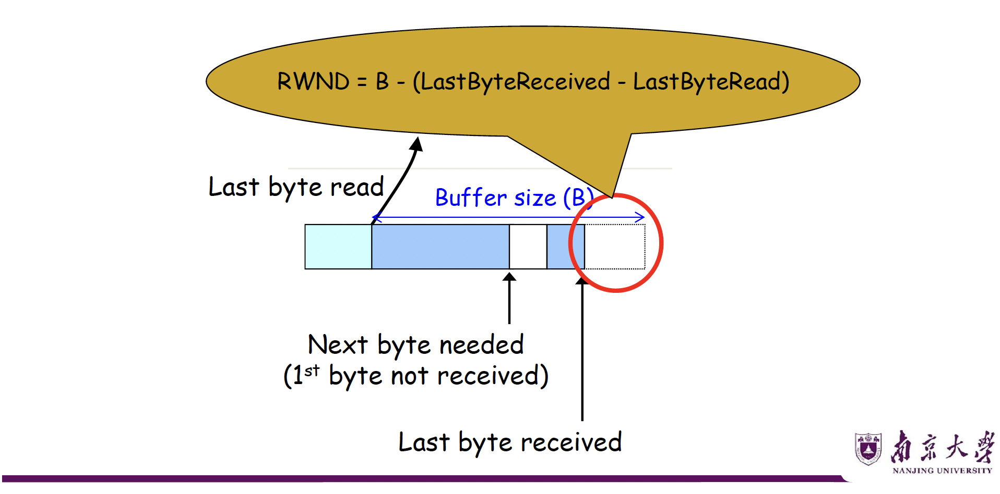
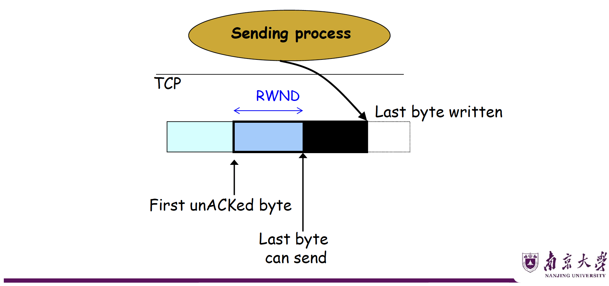
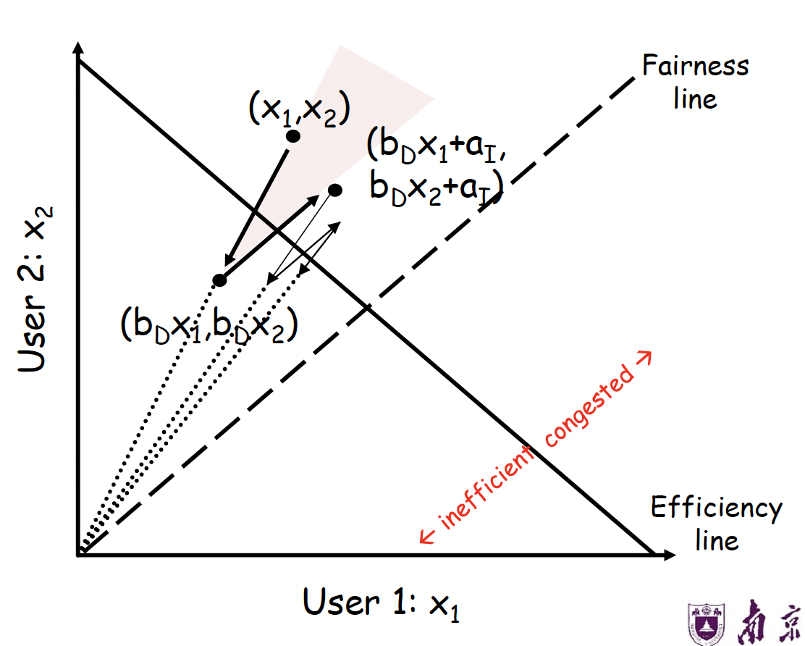
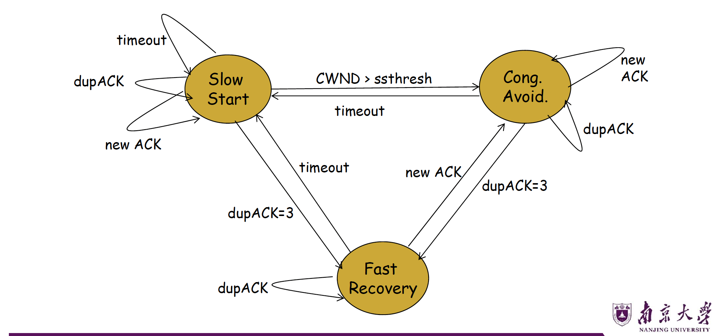

# 运输层 Part3

---

## 一、TCP 流量控制（Flow Control）

### 1.1 滑动窗口机制回顾

**核心思想：** 发送方和接收方各自维护一个"窗口"，用于控制数据的发送与接收。

#### 发送方窗口

**左边界**为第一个未被确认的字节（First unACKed byte），**右边界**为左边界 + 窗口常数（即最多可发送到的位置）。

窗口大小受**传输层缓冲区大小**限制。

#### 接收方窗口

**左边界**为下一个期望接收的字节（Next byte needed），**右边界**为左边界 + 缓冲区剩余空间。

若发送方不受控制，可能**溢出接收方缓冲区**。

---

### 1.2 固定滑动窗口的问题

| 问题 | 说明 |
|------|------|
| 无法区分丢包与流控 | 接收方停止发送ACK可实现流控，但发送方无法判断是"ACK丢失"还是"流控暂停" |
| 不灵活 | 窗口大小固定，无法动态反映接收方缓冲区变化 |

> 没收到`ACK`这件事有两种可能，一是receiver在做流量控制，二是网络传输出现了问题。

---

### 1.3 信用机制（Credit Scheme）—— TCP 的解决方案

#### 核心公式

$$RWND = B - (LastByteReceived - LastByteRead)$$

其中：

- $B$：接收方缓冲区总大小
- $LastByteReceived$：最后一个已收到的字节序号
- $LastByteRead$：接收进程最后一个读取的字节序号
- $RWND$（Receiver Window）：接收方通告窗口，即剩余可用缓冲区

<figure markdown="span">
{ width=75% }
</figure>

#### 发送方约束

$$LastByteSent - LastByteAcked \leq RWND$$

<figure markdown="span">
{ width=70% }
</figure>

??? info
      图中的`Last byte written`可能在`Last byte can send`前，也可能在后。

#### 工作机制

**接收方**在每个ACK中携带 `RWND` 字段（对应TCP头部的 **Advertised Window** 字段）；**发送方**则保证 **在途字节数（bytes in flight）≤ RWND**。

当收到新的`ACK`时，发送方的窗口可以往前滑；当当接收应用把缓冲区里的数据读走时，接收方窗口可以往前滑。

注意，UDP协议是没有这一套流量控制机制的。

#### 信用机制的优势

1. **流控与ACK解耦**：可以区分到底是receiver在控流还是网络出现了问题。也支持做更多的操作，比如确认接收数据但不分配发送额度。
2. **更灵活的控制**：接收方可精细控制发送速率。
3. **序号基于字节**：每个字节都有序号，窗口控制精度更高。

---

### 1.4 TCP 头部相关字段

```
+--------------------+---------------------+
|   Source Port      |   Destination Port  |
+------------------------------------------+
|              Sequence Number             |
+------------------------------------------+
|            Acknowledgment Number         |
+------------------+---+-------------------+
| HdrLen | 0 | Flags |  Advertised Window  |
+------------------+---+-------------------+
|    Checksum        |   Urgent Pointer    |
+------------------------------------------+
|           Options (variable)             |
+------------------------------------------+
|                  Data                    |
+------------------------------------------+
```

- **Sequence Number**：本段第一个字节的序号
- **Acknowledgment Number (AN)**：期望收到的下一字节序号（即已累积确认到此前）
- **Advertised Window (W)**：接收方当前可接受的字节数（RWND）

**当ACK = (AN=i, W=j) 时含义：**序号 $i-1$ 及之前的所有字节已被确认，下一个期望字节序号为 $i$，允许发送方继续发送序号 $i$ 到 $i+j-1$ 的数据（共 $j$ 字节）。

---

### 1.5 信用分配死锁（Credit Allocation Deadlock）

#### 死锁场景

1. B 向 A 发送：`AN=i, W=0`（关闭接收窗口）
2. B 缓冲区释放后，再次发送：`AN=i, W=j`（重开窗口），但此报文**丢失**
3. 此时：A 认为窗口关闭（停止发送），B 认为窗口已打开（等待数据）→ **死锁**

#### 解决方案：窗口探测计时器（Window Timer / Persist Timer）

- 当计时器超时且未收到任何报文，发送方主动发送**探测报文**（可以是前一报文的重传）
- 触发接收方重新发送包含最新窗口值的ACK，打破死锁

> ⚠️ **易错点**：UDP **不具备**流量控制，数据可能因接收方缓冲区溢出而丢失。

---

## 二、TCP 拥塞控制（Congestion Control）

这个部分我们主要聚焦网络中间的“路由器/链路”，不让中间的传输链路被拥塞堵爆。

### 2.1 历史背景

- 1981年：TCP 标准化并广泛部署，**未考虑拥塞控制**
- 1986年10月：互联网出现首次**拥塞崩溃（Congestion Collapse）**：从LBL 到 UC Berkeley（相距400码，2跳），吞吐量从 **32 Kbps 骤降至 40 bps**
- Van Jacobson 提出修复方案，开创拥塞控制研究领域

#### Jacobson 方案的核心思路

在已有窗口机制基础上，**动态调整窗口大小**以响应拥塞，无需修改路由器或应用程序，仅需**修改 TCP 实现的少量代码**。

至今仍被广泛研究改进（尤其在数据中心场景）。

---

### 2.2 拥塞控制的关键设计问题

#### 三个核心问题

| 问题 | 解决方向 |
|------|---------|
| 如何发现可用瓶颈带宽 | 慢启动（Slow Start） |
| 如何适应带宽变化 | 拥塞避免 AIMD |
| 如何在多流间公平共享带宽 | AIMD 的数学特性 |

#### 两个基本问题

1. **如何检测拥塞？**
   - 包延迟：信号噪声大，难以可靠判断
   - 路由器显式通知（ECN）
   - **丢包**检测：TCP 的默认信号（fail-safe），但存在误判，比如非拥塞丢包（如无线链路误码）

2. **如何调整发送速率？**
   - 收到新 ACK → 增大速率
   - 检测到丢包 → 减小速率

---

### 2.3 拥塞控制方案对比

| 方案 | 特点 | 缺陷 |
|------|------|------|
| 不控制（Send without care） | 无需任何机制 | 大量丢包，拥塞崩溃 |
| 预留资源（Reservations） | 精确分配带宽 | 需要提前协商，利用率低 |
| 定价机制（Pricing） | 高出价者优先 | 需要支付模型，不实用 |
| **动态调整（Dynamic Adjustment）** | 灵活，无需先验知识 | 次优，动态过程复杂 |

**动态调整的优势：**

- 不预设商业模式、流量特征、应用需求
- 但**依赖端系统的良好公民行为（Good Citizenship）**

---

### 2.4 拥塞窗口（CWND）

TCP 通过维护一个**拥塞窗口（Congestion Window, CWND）** 来限制发送速率：

$$\text{实际发送窗口} = \min(CWND, RWND)$$

- CWND：拥塞控制角度的发送限制
- RWND：流量控制角度的接收方限制
- 两者取最小值，**同时满足流控和拥塞控制**

---

### 2.5 慢启动（Slow Start）

#### 目标

在不了解网络带宽的情况下，**从小到大快速探测**可用带宽。

#### 机制

规定初始$CWND = 1$个MSS（最大报文段），初始发送速率为$\frac{MSS}{RTT}$。

当**每收到一个新 ACK**，就执行$CWND = CWND + 1$，带来的效果就是每个 RTT，CWND **翻倍**（指数增长）。

#### 慢启动何时停止？

引入**慢启动阈值（ssthresh，Slow Start Threshold）**：

- 初始值：设置为一个较大值（如 65535 字节）
- 当 $CWND > ssthresh$ 时：**停止慢启动，进入拥塞避免**

> ⚠️ **易错点**："慢启动"不慢！名字的"慢"是指初始窗口从 1 开始（相对于一次发送大量数据而言），但增长速度是**指数级**的，非常快。

---

### 2.6 拥塞避免——AIMD

#### 进入条件

$CWND > ssthresh$.

目的是放缓快速扩张，对带宽的估计进行微调。

#### 加法增大（Additive Increase, AI）

- 每个 RTT，CWND 增加 1 MSS（线性增长）
- 实现方式：**每收到一个 ACK**，$CWND = CWND + \frac{1}{CWND}$（MSS单位），等效于当一个完整窗口的数据都被确认后，CWND 才增加 1

#### 乘法减小（Multiplicative Decrease, MD）

**触发条件1：收到3个重复ACK（Triple Duplicate ACK）**

$$ssthresh = \frac{CWND}{2}$$

$$CWND = ssthresh \text{（进入拥塞避免/快速恢复）}$$

**触发条件2：超时（Timeout）**

$$ssthresh = \frac{CWND}{2}$$

$$CWND = 1 \text{（重新开始慢启动）}$$

#### 为什么选择 AIMD 而非其他？

| 策略 | 增长方式 | 减小方式 | 收敛性 |
|------|---------|---------|--------|
| AIAD | 加法 | 加法 | 不收敛到公平点 |
| **AIMD** | **加法** | **乘法** | **收敛到公平且高效** |
| MIAD | 乘法 | 加法 | 不收敛 |
| MIMD | 乘法 | 乘法 | 不收敛到公平点 |

#### AIMD 公平性的数学证明（直观理解）

在二维坐标系（$x_1$, $x_2$ 分别为两个用户的发送速率）中，定义**效率线**为$x_1 + x_2 = C$（链路容量），**公平线**为$x_1 = x_2$.

AIMD 的行为轨迹：

- 未拥塞时：沿45°方向（$+a_I, +a_I$）向右上方移动
- 拥塞时：向原点方向（乘以 $b_D$）收缩
- 这两个方向的迭代轨迹**收敛到效率线与公平线的交点**

<figure markdown="span">
{ width=60% }
</figure>

---

### 2.7 快速重传与快速恢复（Fast Retransmit & Fast Recovery）

#### 为什么需要快速恢复？

收到3个重复`ACK`时，网络仍在转发其他包（说明没有完全中断），不应该像超时一样重置到 $CWND=1$。

换句话说，发送方收到 3 个重复 `ACK` 后，知道前面那个包大概率丢了；马上重传丢失包，这叫 Fast Retransmit；同时不清空网络，而是进入 Fast Recovery；等到收到一个新的 `ACK`（说明丢的包终于补到了），退出 Fast Recovery，回到拥塞避免。

#### 快速恢复机制（TCP Reno）

**步骤：**

1. 收到第3个重复ACK时：

      - $ssthresh = CWND / 2$
      - $CWND = ssthresh + 3$（`+3` 是因为3个`dupACK`表明3个包已离开网络）
      - 立即重传丢失的包

2. 快速恢复期间（持续收到重复ACK）：

      - 每收到一个额外的重复ACK：$CWND = CWND + 1$（维持管道中的数据量）

3. 收到新ACK后退出快速恢复：

      - $CWND = ssthresh$
      - 进入拥塞避免阶段

#### 具体示例分析（CWND=10，包101丢失）

| 事件 | CWND | 说明 |
|------|------|------|
| 收到dupACK #1 (due to 102) | 10 | 正常计数 |
| 收到dupACK #2 (due to 103) | 10 | 正常计数 |
| 收到dupACK #3 (due to 104) | → 8 | ssthresh=5, CWND=5+3=8，重传101 |
| 收到dupACK #4 (due to 105) | 9 | CWND+1，无新包可发 |
| 收到dupACK #5 (due to 106) | 10 | CWND+1，无新包可发 |
| 收到dupACK #6 (due to 107) | 11 | 发送111 |
| ... | ... | ... |
| 收到新ACK 111 (due to 101) | → 5 | **退出快速恢复**，CWND=ssthresh=5，发送115 |
| 收到ACK 112 (due to 111) | 5+1/5 | 进入拥塞避免（线性增长） |

---

### 2.8 TCP 状态机

<figure markdown="span">
{ width=80% }
</figure>

**状态转换规则总结：**

| 当前状态 | 事件 | 动作 | 下一状态 |
|---------|------|------|---------|
| Slow Start | new ACK | CWND += 1 | Slow Start |
| Slow Start | CWND > ssthresh | — | Cong. Avoid. |
| Slow Start | timeout | ssthresh=CWND/2, CWND=1 | Slow Start |
| Slow Start | dupACK=3 | ssthresh=CWND/2, CWND=ssthresh+3 | Fast Recovery |
| Cong. Avoid. | new ACK | CWND += 1/CWND | Cong. Avoid. |
| Cong. Avoid. | timeout | ssthresh=CWND/2, CWND=1 | Slow Start |
| Cong. Avoid. | dupACK=3 | ssthresh=CWND/2, CWND=ssthresh+3 | Fast Recovery |
| Fast Recovery | dupACK | CWND += 1 | Fast Recovery |
| Fast Recovery | new ACK | CWND = ssthresh | Cong. Avoid. |
| Fast Recovery | timeout | ssthresh=CWND/2, CWND=1 | Slow Start |

---

### 2.9 各种 TCP 版本对比

| TCP 版本 | 3个dupACK处理 | 超时处理 | 备注 |
|---------|-------------|---------|------|
| **TCP Tahoe** | CWND=1，慢启动 | CWND=1，慢启动 | 最早版本，激进 |
| **TCP Reno** | CWND=CWND/2，快速恢复 | CWND=1，慢启动 | 标准版本 |
| **TCP NewReno** | Reno + 改进的快速恢复 | CWND=1，慢启动 | 处理多包丢失更好 |
| **TCP SACK** | 结合选择确认 | CWND=1，慢启动 | 精确知道哪些包丢失 |

> ⚠️ **考研重点**：408默认考察 **TCP Reno** 的行为（即3个dupACK时CWND减半而非置1）。

---

## 三、路由器辅助的拥塞控制

### 3.1 TCP 的固有问题

| 问题 | 描述 |
|------|------|
| 混淆丢包原因 | 无线链路误码导致的丢包被误认为拥塞 |
| 缓冲区占满 | 导致排队延迟高（Bufferbloat问题） |
| 短流无法发现带宽 | 流结束前还在慢启动阶段 |
| 高速链路下AIMD效率低 | 每次丢包减半代价太大 |
| RTT不公平 | RTT短的流获得更多带宽 |
| 端系统可作弊 | 恶意发送方可不遵循拥塞控制 |

**路由器可以帮助解决其中多个问题！**

??? warning 注意
      TCP只有一个流的话是撑不满带宽的（最多75%），只有多个流竞争才能跑满。

      TCP最大的弱点：吃满带宽而且吃满队列，此时会对RTT造成很大的伤害。

      TCP的最佳工作点：**队列是空的， 带宽是满的**。

---

### 3.2 显式拥塞通知（ECN，Explicit Congestion Notification）

#### 机制

- 在 IP 头部（使用 ToS/DSCP 字段，RFC 3168）设置 **ECN 比特**
- 路由器检测到拥塞时**主动标记**数据包（而非丢弃）
- 接收方在 ACK 中回传 ECN 标记
- 发送方收到带 ECN 的 ACK 后，像收到丢包信号一样减小 CWND

#### ECN 的优势

| 优势 | 说明 |
|------|------|
| 区分拥塞与误码丢包 | 无线环境中不再误触发减窗 |
| 早期拥塞预警 | 在队列满之前就能通知，避免高延迟 |
| 增量部署友好 | 不需要大规模改造，今天已在数据中心广泛使用 |
| 语义兼容TCP | 端系统行为与收到丢包相同，无需修改上层逻辑 |

---

### 3.3 其他路由器辅助机制

| 机制 | 中文名 | 描述 |
|------|-------|------|
| Choke Packet | 抑制分组 | 路由器向源端发送"降速"控制包 |
| Backpressure | 反压 | 逐跳通知上游节点降速 |
| Warning Bit (ECN) | 警告位 | 在数据包头部标记拥塞 |
| Random Early Discard (RED) | 随机早期丢弃 | 队列未满时就概率性丢包，提前预警 |
| Fair Queuing (FQ) | 公平队列 | 路由器为每个流维护独立队列，强制公平 |

---

## 四、易错点与高频考点汇总

### 📌 易错点 1：流控 vs 拥塞控制的区别

| 维度 | 流量控制 | 拥塞控制 |
|------|---------|---------|
| 控制对象 | 接收方缓冲区 | 网络链路带宽 |
| 窗口名称 | RWND（接收窗口） | CWND（拥塞窗口） |
| 信息来源 | 接收方ACK中携带 | 发送方自行推断（丢包/延迟） |
| 机制位置 | 端到端 | 端到端（可路由器辅助） |
| 是否UDP支持 | ❌ UDP无流控 | ❌ UDP无拥塞控制 |

**实际发送窗口 = min(CWND, RWND)**，两者同时约束发送速率。

---

### 📌 易错点 2：慢启动"慢"在哪里？

- "慢"指**初始窗口为1 MSS**，不是增长速度慢
- 慢启动阶段实际是**指数增长**，增速极快
- 每个RTT翻倍，到达ssthresh后才切换为线性增长

---

### 📌 易错点 3：三个重复ACK vs 超时的响应差异

| | 3个重复ACK | 超时 |
|-|-----------|------|
| 严重程度 | 较轻（还在收ACK） | 严重（完全停顿） |
| ssthresh | CWND/2 | CWND/2 |
| CWND | **CWND/2**（Reno） | **1** |
| 下一阶段 | 快速恢复→拥塞避免 | 慢启动 |

---

### 📌 易错点 4：ssthresh 的更新时机

ssthresh **只在发生拥塞事件时更新**（即检测到丢包时），而不是每个RTT都更新。

---

### 📌 易错点 5：CWND 增长的精确计算

**慢启动阶段**（CWND ≤ ssthresh）：

- 每收到1个ACK：CWND += 1 MSS
- 每个RTT：CWND 翻倍

**拥塞避免阶段**（CWND > ssthresh）：

- 每收到1个ACK：CWND += MSS × (MSS/CWND)
- 每个RTT：CWND += 1 MSS（线性增长）

---

### 📌 高频考点 1：CWND 变化的计算题

**典型题型：** 给出初始 ssthresh 和 CWND，以及若干轮次的事件，计算各时刻的 CWND 值。

**解题步骤：**

1. 判断当前处于慢启动还是拥塞避免
2. 按规则更新 CWND
3. 遇到丢包事件，区分超时和dupACK，分别处理
4. 注意 ssthresh 的更新

---

### 📌 高频考点 2：吞吐量计算

TCP 在稳态（仅考虑拥塞避免）下的平均吞吐量近似为：

$$\text{Throughput} \approx \frac{0.75 \times W}{RTT}$$

其中 $W$ 为发生丢包时的窗口大小（单位：MSS）。

更精确的公式（考虑丢包率 $p$）：

$$\text{Throughput} \approx \frac{MSS}{RTT\sqrt{p}}$$

---

### 📌 高频考点 3：TCP 公平性

在相同 RTT、相同瓶颈链路的情况下，AIMD 保证多条流**收敛到公平共享**（各流获得相等带宽）。

但以下情况破坏公平性：

- **RTT 不同**：RTT 短的流反应更快，获得更多带宽
- **并行连接**：应用开多条TCP连接可获得更多份额（如早期HTTP）

---

### 📌 高频考点 4：RWND = 0 时的处理

当接收方通告 RWND=0 时：

- 发送方**停止发送**（但可发送1字节的探测报文）
- 使用**持续计时器（Persist Timer）** 定期探测
- 防止死锁：接收方缓冲区释放后重新通告窗口，但若ACK丢失则陷入死锁

---

### 📌 典型计算题示例

**题目：** 设 TCP 的 ssthresh 初始值为 8（单位MSS），在第3轮时发生超时，在第7轮时收到3个重复ACK。试画出拥塞窗口的变化图并标出各阶段。

**解题过程：**

| 轮次 | CWND | 阶段 | 事件 |
|------|------|------|------|
| 1 | 1 | SS | 初始 |
| 2 | 2 | SS | 指数增长 |
| 3 | 4 | SS→超时 | 超时！ssthresh=4/2=2? |

> 注意：第3轮**发生**超时，说明第3轮传输时CWND=4，超时后：ssthresh=4/2=2，CWND=1，重新慢启动

| 轮次 | CWND | 阶段 |
|------|------|------|
| 1 | 1 | SS |
| 2 | 2 | SS |
| 3 | 4 | **超时** → ssthresh=2, CWND=1 |
| 4 | 1 | SS |
| 5 | 2 | SS→CA（CWND=ssthresh=2） |
| 6 | 3 | CA |
| 7 | 4 | **3dupACK** → ssthresh=2, CWND=2 |
| 8 | 2 | CA（快速恢复后） |
| 9 | 3 | CA |

---

## 五、知识框架总结

```
运输层（传输层）
│
├── 流量控制（Flow Control）
│   ├── 目的：防止接收方缓冲区溢出
│   ├── 机制：滑动窗口 + RWND 通告
│   ├── 公式：RWND = B - (LastByteRcvd - LastByteRead)
│   └── 问题：RWND=0死锁 → 持续计时器解决
│
└── 拥塞控制（Congestion Control）
    ├── 目的：防止网络链路过载
    ├── 检测：丢包（超时/dupACK）/ ECN
    ├── 机制
    │   ├── 慢启动（Slow Start）
    │   │   ├── CWND=1起步，指数增长
    │   │   └── 直到 CWND > ssthresh
    │   ├── 拥塞避免（AIMD）
    │   │   ├── 线性增（+1/RTT）
    │   │   └── 乘法减（×1/2 on loss）
    │   └── 快速恢复（Fast Recovery）
    │       ├── 3dupACK触发
    │       └── CWND = ssthresh + 3，继续发包
    ├── TCP版本：Tahoe / Reno / NewReno / SACK
    └── 路由器辅助：ECN / RED / FQ
```

---

> 📝 **备考建议**：TCP拥塞控制是408的高频考点，每年几乎必考计算题。建议重点掌握：①CWND的精确计算规则；②状态机的转换条件；③超时 vs 3dupACK的不同处理；④慢启动与拥塞避免的边界条件（ssthresh）。